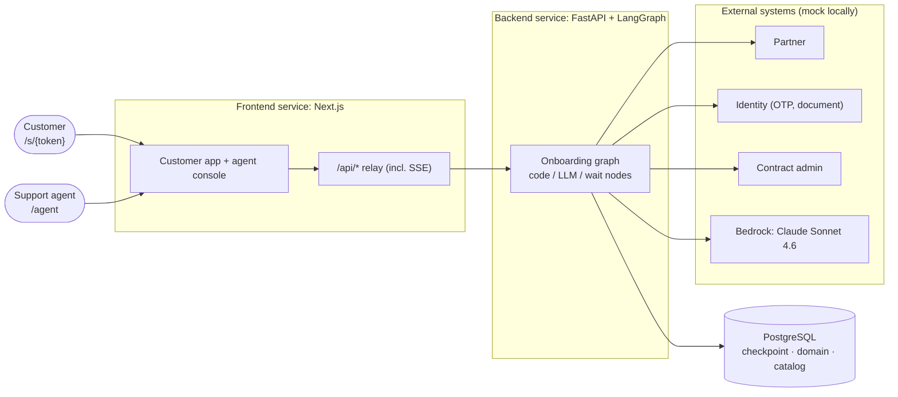

# AI Customer Onboarding & Policy Recommendation Assistant

An assistant that takes an insurance customer from identity verification to a submitted application, while
support agents watch every session and take over when needed. A LangGraph graph in the backend runs the four
stages: identity verification, customer profiling, policy recommendation and policy application. It pauses
whenever it needs a person and resumes from a Postgres checkpoint. Code decides eligibility, ranking and price;
Claude Sonnet 4.6 on Amazon Bedrock extracts values from free text and writes explanations and summaries. The
system is two separately deployed services (a Next.js frontend with a customer app and an agent console, and a
FastAPI + LangGraph backend) on ECS Fargate in ap-northeast-2, provisioned with Terraform and deployed with GitHub
Actions. The partner, identity and contract admin systems are one mock service locally and in develop; the same
mock stands in for Bedrock locally, while develop calls real Bedrock.

## Architecture



In AWS: ALB (HTTPS and Cognito for the agent paths once a domain is set; develop uses `onboardassist.click`) →
frontend on ECS → backend on ECS via Service Connect → RDS PostgreSQL; Bedrock and other AWS APIs through VPC
endpoints. See [docs/aws-architecture.md](docs/aws-architecture.md).

## Quick start

Requires Docker with Compose.

```bash
docker compose up --build
```

| Service | URL |
|---|---|
| Agent console | http://localhost:13000/agent (development auth: you are `agent-demo`) |
| Customer app | Click **New session** in the agent console, pick KR or US, and open the `/s/{token}` link it shows |
| Backend API | http://localhost:18000 (health: `/healthz`) |
| Mock external systems | http://localhost:18080 (faults: `/_mock/faults`, reset: `/_mock/reset`) |
| PostgreSQL | `localhost:15432`, user / password / db `onboarding` |

No AWS account is needed locally: the backend's Bedrock client points to the mock (`BEDROCK_ENDPOINT_URL`). The
backend creates its tables and seeds the eight-product catalog when it starts. Walk through the four seed
customers in [docs/demo.md](docs/demo.md).

## Repository layout

```
backend/            FastAPI + LangGraph (Python 3.13, uv)
mock/               one FastAPI app: /partner /identity /contract /model/{id}/converse /_mock
frontend/           Next.js 16 (App Router, TypeScript, pnpm): app/s, app/agent, app/api (relay), proxy.ts
infra/              Terraform: bootstrap/, modules/{network,security,data,auth,edge,service,ci}, envs/{develop,prod}
.github/workflows/  CI and deploy workflows
contracts/          seed customers shared by the mock, backend tests and the demo
docs/               design documents
CONTRACTS.md        API, mock and LLM-shape contracts between the services
docker-compose.yml  local stack: postgres, mock, backend, frontend
```

## Running tests

```bash
# backend: DB-backed tests need the compose Postgres on localhost:15432 (they are skipped without it)
docker compose up -d postgres
cd backend && uv sync && uv run ruff check . && uv run pytest

# mock
cd mock && uv sync && uv run ruff check . && uv run pytest

# frontend
cd frontend && pnpm install && pnpm lint && pnpm typecheck && pnpm test && pnpm build

# terraform (no AWS access needed)
cd infra/envs/develop && terraform init -backend=false && terraform validate
```

Tests never call AWS. Backend graph tests run the seed customers against in-process fakes of the external
systems and the LLM, built from the same seed file as the mock (`backend/tests/fixtures/seed-customers.json`).

Results at the time of writing: backend 111 passed, mock 75 passed, frontend 20 passed (vitest) with lint, type
check and build clean. An end-to-end run through `docker compose` gave the outcomes listed in
[docs/demo.md](docs/demo.md#2-seed-customers-and-expected-outcomes): A, B and C submitted; D handed off.

## Documents

| Document | Contents |
|---|---|
| [Solution architecture](docs/solution-architecture.md) | C4 context and containers, frontend-to-backend communication, inside the backend |
| [LangGraph design](docs/langgraph-design.md) | Four stages, nodes by type, graph and conditional edges, interrupt/resume, handoff, error handling, the six LangGraph requirements |
| [State management](docs/state-management.md) | State schema, reducers, routing signals, encrypted Postgres checkpoints, idempotent writes, personal data |
| [Data model](docs/data-model.md) | Entities, ER diagram, state transitions, product catalog seed |
| [AWS architecture](docs/aws-architecture.md) | Services and why, Bedrock, IAM, storage, environments |
| [Networking design](docs/networking.md) | VPC and subnets, endpoints and NAT, traffic flows, security groups, security boundaries, authentication |
| [Terraform structure](docs/terraform.md) | Modules, environments, state backend, one-time setup |
| [CI/CD design](docs/cicd.md) | GitHub Actions with OIDC, CI checks, develop deploy, prod promotion, smoke test, GitHub settings |
| [Assumptions](docs/assumptions.md) | How we read the open parts of the brief |
| [Tradeoffs](docs/tradeoffs.md) | Infrastructure, LLM and checkpoint-store choices, with the evidence behind them |
| [Future improvements](docs/future-improvements.md) | Known limits of what is built, and designed but deferred work |
| [Demo walkthrough](docs/demo.md) | Seed customers A–D, what each one shows, and the expected outcomes |

## Scope and what is deferred

Built for this submission:

- The full four-stage LangGraph graph with wait nodes (`interrupt`), conditional edges after every node, retries,
  3-round loop guards and human handoff (`human_handoff` + `await_agent`), on `AsyncPostgresSaver` with
  compress-then-AES encryption.
- Eligibility, ranking and pricing in code over an eight-product KR/US catalog.
- Claude Sonnet 4.6 through `ChatBedrockConverse`, with a per-node model override setting.
- One mock service for partner, identity, contract admin and Bedrock, with seed customers A–D and fault injection.
- A frontend with the customer app and an agent console: session list, conversation, progress and application
  views, new session links, take over, answer as agent, handoff resolution.
- Terraform for both environments (develop has a domain, HTTPS and Cognito at the ALB), a bootstrap stack for
  remote state, CI checks, a develop deploy workflow and a prod promotion workflow.

Known limits (details in [docs/future-improvements.md](docs/future-improvements.md#1-known-limits-of-what-is-built)):

- SSE pub/sub and per-session locks are in-process: run one backend replica (or keep sessions sticky).
- Session links store `token_expires_at` but do not enforce it.
- Agent auth in the frontend is a development switch (`AGENT_DEV_AUTH`); the hook for the ALB's Cognito headers
  exists, but verifying `x-amzn-oidc-data` is a TODO.
- One customer session cookie per browser.

Designed, not built (details in [docs/future-improvements.md](docs/future-improvements.md)):

- Returning-customer linking and the customer history tab.
- ASSIST draft approval (AI messages held for agent review).
- The 30-day checkpoint cleanup job and checkpoint key rotation.
- A domain for prod, the prod apply, and a prod promotion run.
- Moving extraction nodes to Claude Haiku 4.5, with an evaluation set to justify it.
- Tiered deductibles and age/state-based travel pricing in the catalog.
