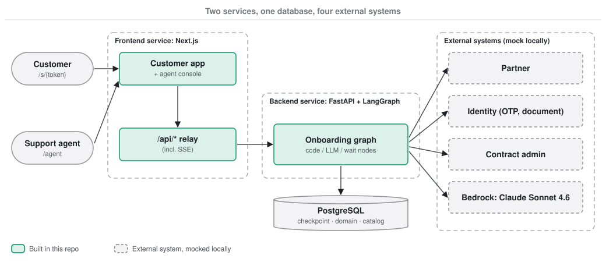

<h1 align="center">Onboarding Assistant</h1>

<h3 align="center">
AI customer onboarding and policy recommendation, from identity check to submitted application
</h3>

<p align="center">
| <a href="https://onboardassist.click/docs/"><b>Documentation</b></a>
| <a href="https://onboardassist.click/agent"><b>Live demo</b></a>
| <a href="https://onboardassist.click/docs/design/01-solution-architecture/"><b>Architecture</b></a>
| <a href="https://onboardassist.click/docs/guides/demo/"><b>Demo walkthrough</b></a>
| <a href="https://onboardassist.click/docs/guides/development/"><b>Development</b></a> |
</p>

---

## About

An assistant that takes an insurance customer through **identity verification, customer profiling, policy
recommendation and policy application**, while support agents watch every session and take over when needed.

- **A LangGraph graph runs the four stages.** It pauses whenever it needs a person and resumes from an encrypted
  Postgres checkpoint; failures and dead ends hand the session to an agent.
- **Code decides, the LLM explains.** Eligibility, ranking and price are deterministic code; Claude Sonnet 4.6 on
  Amazon Bedrock extracts values from free text and writes explanations and summaries.
- **Two services on AWS.** A Next.js frontend (customer app and agent console) and a FastAPI + LangGraph backend
  on ECS Fargate, provisioned with Terraform and deployed with GitHub Actions.
- **Runs anywhere without AWS.** One mock service stands in for the partner, identity, contract admin systems and
  Bedrock, with four seed customers that each show a different path.



## Getting started

```bash
docker compose up --build
```

Open http://localhost:13000/agent, click **New session**, and open the customer link it shows. The
[demo walkthrough](docs/guides/demo.md) takes you through the four seed customers; the
[development guide](docs/guides/development.md) covers the other services, the repository layout and the tests.

## Documentation

The design documents live in [`docs/`](docs/README.md) and are published at
[onboardassist.click/docs](https://onboardassist.click/docs/):

- **Design**: solution architecture, LangGraph design, state management, data model, observability
- **Infrastructure**: AWS architecture, networking, Terraform, CI/CD
- **Decisions**: assumptions, tradeoffs, and future improvements with the [known limits](docs/decisions/future-improvements.md#1-known-limits-of-what-is-built)
- **Research**: the notes behind the design

[docs/README.md](docs/README.md) maps each document the brief asks for to the section that answers it. The
contracts between the services are in [CONTRACTS.md](CONTRACTS.md).
