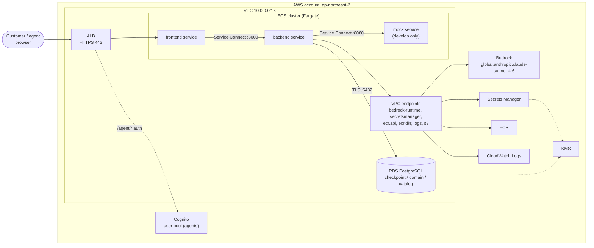

# AWS architecture

The containers from [solution-architecture.md](solution-architecture.md) mapped to AWS. Network details are in
[networking.md](networking.md), the Terraform code layout in [terraform.md](terraform.md).

Everything runs in one region: **ap-northeast-2 (Seoul)**. Users are close to it, and one region keeps the
network simple.

## 1. Overview

## 2. Services and why

| Service | Used for | Why |
|---|---|---|
| **ECS on Fargate** | Runs the frontend, backend and (develop only) mock as three ECS services | Required by the brief. Fargate removes host management. One task definition per service lets frontend and backend deploy independently |
| **Application Load Balancer** | Public HTTPS entry. Routes to the frontend. Authenticates `/agent/*` with Cognito | Built-in Cognito authentication, health checks, and SSE support once the idle timeout is raised to 300 s |
| **RDS for PostgreSQL** | One instance, three schemas: `checkpoint`, `domain`, `catalog` | Entities are relational. `PostgresSaver` takes an encrypting serializer as a normal argument. One instance is the cheapest option |
| **Amazon Bedrock** | LLM calls through the Converse API. Model `global.anthropic.claude-sonnet-4-6` with **global cross-region inference** from Seoul | The account has quota and accepted terms for this model, and it handles Korean extraction and summaries well. See [tradeoffs.md](tradeoffs.md#2-llm-claude-sonnet-46-on-bedrock) |
| **Secrets Manager** | DB credentials (managed by RDS), checkpoint AES key, session signing key, HMAC key for session tokens and ID numbers | Tasks read secrets through their IAM role; nothing sensitive is in images or task definitions |
| **KMS** | Customer-managed key for RDS storage and for secrets | Encryption at rest with a key the account controls |
| **Cognito** | User pool for support agents, one per environment | Agents are staff with accounts. ALB integrates with it directly |
| **ECR** | One repository per image (frontend, backend, mock). Tag = commit SHA | The same image moves from develop to prod without a rebuild |
| **CloudWatch Logs** | One log group per service | Standard ECS logging. Message bodies are not logged |
| **VPC endpoints** | Private access to Bedrock, Secrets Manager, ECR, CloudWatch Logs, S3 | Customer conversations sent to Bedrock never cross the public internet |
| **S3** (Terraform state) | One state file per environment, with locking | Standard remote backend |

Customers do not use Cognito. They have no account; the backend issues a random session token and the customer
opens `/s/{token}`. See [networking.md](networking.md#5-authentication).

## 3. Bedrock

- **Model:** Claude Sonnet 4.6, called as the global inference profile `global.anthropic.claude-sonnet-4-6`
  from `ap-northeast-2`. Requests may be served in another region. Logs, quota and billing stay in Seoul.
- **Client:** `langchain-aws` `ChatBedrockConverse`, `with_structured_output` in `function_calling` mode.
- **Auth:** the backend ECS task role. No API keys.
- **IAM:** `bedrock:InvokeModel` must allow both the inference profile and the foundation models it points to
  (the region-less `arn:aws:bedrock:::foundation-model/anthropic.claude-sonnet-4-6` and
  `arn:aws:bedrock:ap-northeast-2::foundation-model/anthropic.claude-sonnet-4-6`). If some nodes are switched to
  Haiku 4.5 later, its profile needs the same.
- **Endpoint:** `BEDROCK_ENDPOINT_URL` is set to the mock in develop and local runs, and left unset in prod so
  the SDK uses the regional endpoint (through the VPC endpoint).
- **Per-node model:** the model ID is a setting per node, so extraction nodes can move to Claude Haiku 4.5
  (`global.anthropic.claude-haiku-4-5-20251001-v1:0`) to save cost. The switch itself is future work.

## 4. IAM task roles

| Role | Allowed |
|---|---|
| Frontend | Read the session signing secret; write logs |
| Backend | Invoke Bedrock (above); read the DB credentials, checkpoint key and HMAC keys; KMS decrypt for those secrets; write logs |
| Mock | Write logs |

Each ECS service also has a task execution role for pulling images from ECR and writing logs.

## 5. Storage

| Schema | Holds | Written by | Lifetime |
|---|---|---|---|
| `checkpoint` | LangGraph checkpoint tables (`PostgresSaver`) | The LangGraph runtime | 30 days without activity |
| `domain` | Customer and transaction entities, session links | Graph nodes and the API | The customer relationship |
| `catalog` | Products, eligibility rules, target markets | Migrations at deploy time | While a product is on sale |

- Encrypted at rest with the KMS key; connections require TLS.
- Checkpoint contents are also compressed and AES-encrypted by the application
  ([state-management.md](state-management.md#6-checkpointing)).
- **30-day cleanup (designed, deferred).** PostgreSQL has no TTL. The plan is an EventBridge Scheduler rule that
  starts a daily ECS task (backend image, cleanup command). It finds threads whose session has been inactive for
  30 days in the `domain` schema and deletes them through the checkpointer's delete-thread API.

## 6. Environments

One AWS account, two environments. Each has its own VPC and its own Terraform state.

| | develop | prod |
|---|---|---|
| External systems | Mock service (one ECS service) | Real endpoints. Partner, identity and contract admin do not exist yet, so they are left empty |
| NAT gateways | 1 | 1 per AZ |
| Interface endpoints | One AZ (2a) only | Both AZs |
| ECS tasks | 1 per service | 2 per service, spread across AZs |
| RDS | Single-AZ, small instance | Multi-AZ |
| Cognito | Own user pool | Own user pool |
| Deploy | Automatic on merge to `develop` | Manual, after approval, same image SHA |

Scope for this submission: `envs/develop` is the complete environment; `envs/prod` uses the same modules with
different variables, and applying it is deferred. HTTPS and Cognito need a domain, which does not exist yet; they
are wired in Terraform behind a domain variable, and agents use a development header until then.
