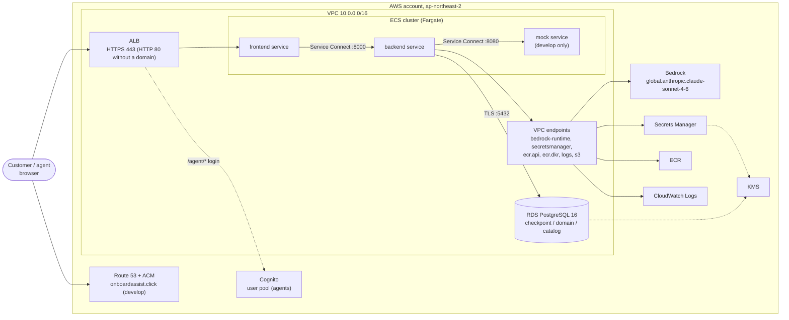

# AWS architecture

The containers from [solution-architecture.md](solution-architecture.md) mapped to AWS. Network details are in
[networking.md](networking.md), the Terraform code layout in [terraform.md](terraform.md).

Everything runs in one region: **ap-northeast-2 (Seoul)**. Users are close to it, and one region keeps the
network simple.

## 1. Overview

## 2. Services and why

| Service | Used for | Why |
|---|---|---|
| **ECS on Fargate** | Runs the frontend, backend and (develop only) mock as three ECS services in one cluster, with Container Insights | Required by the brief. Fargate removes host management. One task definition per service lets frontend and backend deploy independently |
| **Application Load Balancer** | Public entry. Routes everything to the frontend. With a domain: HTTPS (TLS 1.2/1.3 policy), HTTP → HTTPS redirect, and Cognito login on `/agent`, `/agent/*`, `/api/agent/*`. Without a domain: plain HTTP on port 80 | Built-in Cognito authentication, health checks, and SSE support with the idle timeout raised to 300 s |
| **Route 53 + ACM** | develop's domain `onboardassist.click` (registered in Route 53, which created the hosted zone). Terraform issues a DNS-validated ACM certificate and an alias record to the ALB | HTTPS and Cognito both need a domain. Public ACM certificates are free |
| **RDS for PostgreSQL** | One PostgreSQL 16 instance, three schemas: `checkpoint`, `domain`, `catalog`. gp3 storage, `rds.force_ssl = 1` | Entities are relational. `PostgresSaver` takes an encrypting serializer as a normal argument. One instance is the cheapest option |
| **Amazon Bedrock** | LLM calls through the Converse API. Model `global.anthropic.claude-sonnet-4-6` with **global cross-region inference** from Seoul | The account has quota and accepted terms for this model, and it handles Korean extraction and summaries well. See [tradeoffs.md](tradeoffs.md#2-llm-claude-sonnet-46-on-bedrock) |
| **Secrets Manager** | The RDS master password (managed by RDS), the checkpoint AES key, and the HMAC key for session tokens and ID numbers. Terraform generates the two application keys | ECS injects them into the backend container as environment variables; nothing sensitive is in images or task definitions |
| **KMS** | One customer-managed key per environment for RDS storage and the secrets | Encryption at rest with a key the account controls |
| **Cognito** | User pool for support agents, one per environment, created only when a domain is set. Admin-created accounts only, email as username, optional TOTP MFA | Agents are staff with accounts. ALB integrates with it directly |
| **ECR** | One repository per image: `onboarding/backend`, `onboarding/frontend`, `onboarding/mock`. Tag = commit SHA, tags immutable, scan on push, newest 50 kept. Shared by develop and prod | The same image moves from develop to prod without a rebuild |
| **CloudWatch Logs** | One log group per service, 30-day retention | Standard ECS logging. Message bodies are not logged |
| **VPC endpoints** | Private access to Bedrock, Secrets Manager, ECR, CloudWatch Logs, S3 | Customer conversations sent to Bedrock never cross the public internet |
| **S3 + DynamoDB** (Terraform state) | One state file per environment in an S3 bucket, locked through a DynamoDB table. Both created by `infra/bootstrap` | Standard remote backend. Terraform 1.5 needs DynamoDB for S3 state locking |

Customers do not use Cognito. They have no account; the backend issues a random session token and the customer
opens `/s/{token}`. See [networking.md](networking.md#5-authentication).

## 3. Bedrock

- **Model:** Claude Sonnet 4.6, called as the global inference profile `global.anthropic.claude-sonnet-4-6`
  from `ap-northeast-2`. Requests may be served in another region. Logs, quota and billing stay in Seoul.
- **Client:** `langchain-aws` `ChatBedrockConverse`, `with_structured_output` in `function_calling` mode,
  temperature 0.
- **Auth:** the backend ECS task role. No API keys.
- **IAM:** `bedrock:InvokeModel` and `bedrock:InvokeModelWithResponseStream` on the inference profile
  (`arn:aws:bedrock:ap-northeast-2:<account>:inference-profile/global.<model>`) and on the foundation models it
  points to (the region-less `arn:aws:bedrock:::foundation-model/<model>` and
  `arn:aws:bedrock:ap-northeast-2::foundation-model/<model>`). Terraform grants this for both Sonnet 4.6 and
  Haiku 4.5 (`anthropic.claude-haiku-4-5-20251001-v1:0`).
- **Endpoint:** `BEDROCK_ENDPOINT_URL` points to the mock only in `docker compose`. In both AWS environments it is
  unset, so the SDK uses the regional endpoint through the `bedrock-runtime` VPC endpoint. Develop calls real
  Bedrock.
- **Per-node model:** `LLM_MODEL_OVERRIDES` can point any LLM node at another model ID, so extraction nodes can
  move to Claude Haiku 4.5 (`global.anthropic.claude-haiku-4-5-20251001-v1:0`) to save cost. No override is set;
  the switch is future work.

## 4. IAM roles

| Role | Allowed |
|---|---|
| Backend task role | Invoke Bedrock (above); read the DB master secret, checkpoint key and HMAC key; KMS decrypt with the project key |
| Frontend task role | Nothing beyond the defaults. The frontend holds no secrets |
| Mock task role | Nothing beyond the defaults |
| Task execution role (one per service) | Pull the image from ECR, write logs; for the backend also read the three secrets and decrypt them, so ECS can inject `PGPASSWORD`, `CHECKPOINT_AES_KEY` and `SESSION_HMAC_KEY` |
| GitHub deploy role (one per environment) | Assumed through GitHub OIDC. `PowerUserAccess`, plus IAM limited to `onboarding-*` roles and policies, the Terraform state bucket and lock table, and ECR push. See [cicd.md](cicd.md#2-oidc-and-roles) |

## 5. Storage

| Schema | Holds | Written by | Lifetime |
|---|---|---|---|
| `checkpoint` | LangGraph checkpoint tables (`AsyncPostgresSaver`) | The LangGraph runtime | Meant to be 30 days without activity (cleanup not built) |
| `domain` | Customer and transaction entities, session links | Graph nodes and the API | The customer relationship |
| `catalog` | Products, eligibility rules, target markets | The backend at startup: `create_all` plus an idempotent seed of the eight products | While a product is on sale |

- Encrypted at rest with the KMS key; the parameter group forces TLS and the backend connects with
  `sslmode=require`. The password comes from the RDS-managed secret as `PGPASSWORD`.
- develop: `db.t4g.micro`, single-AZ, no deletion protection. prod: `db.t4g.small`, Multi-AZ, deletion protection
  and a final snapshot.
- Checkpoint contents are also compressed and AES-encrypted by the application
  ([state-management.md](state-management.md#6-checkpointing)).
- **30-day cleanup (designed, not built).** PostgreSQL has no TTL. The plan is an EventBridge Scheduler rule that
  starts a daily ECS task (backend image, cleanup command). It finds threads whose session has been inactive for
  30 days in the `domain` schema and deletes them through the checkpointer's delete-thread API. A `TODO` in
  `infra/modules/data/main.tf` records this.

## 6. Environments

One AWS account, two environments. Each has its own VPC and its own Terraform state. The Terraform code is the
same; only `terraform.tfvars` differs.

| | develop | prod |
|---|---|---|
| External systems | Mock service (one ECS service) | Real endpoints. Partner, identity and contract admin do not exist yet, so they are `https://*.invalid` placeholders |
| Bedrock | Real, through the VPC endpoint | Real, through the VPC endpoint |
| Domain | `onboardassist.click`: HTTPS, ACM certificate, Cognito on the agent paths | None yet: HTTP-only ALB, no Cognito |
| NAT gateways | 1 | 1 per AZ |
| Interface endpoints | One AZ (2a) only | Both AZs |
| ECS tasks | 1 per service | 2 per service, spread across AZs |
| RDS | `db.t4g.micro`, single-AZ | `db.t4g.small`, Multi-AZ |
| GitHub OIDC provider, ECR repositories | Created here | Looked up from develop |
| Deploy | Automatic on push to `main`, once the deploy role variable is set in GitHub | Manual, after approval, same image SHA |

Scope for this submission: `envs/develop` is the environment the deploy workflow targets; `envs/prod` uses the
same code with different variables, and applying it is deferred. Two things must change before prod: the
backend's in-process session lock assumes one backend task (prod asks for two; SSE events already cross tasks over Postgres `LISTEN/NOTIFY`), and the frontend
must verify the ALB's signed agent header before `AGENT_DEV_AUTH` can be turned off. See
[future-improvements.md](future-improvements.md).
