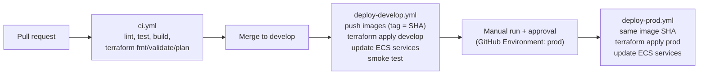

# CI/CD design

GitHub Actions builds, tests and deploys. No AWS credentials are stored in GitHub: each workflow assumes an
environment-specific deploy role through **OIDC**.

## 1. Pipeline

| Workflow | Trigger | Steps |
|---|---|---|
| `ci.yml` | Pull request | Backend and mock: lint, tests (graph tests run against the mock's seed data). Frontend: lint, type check, build. Docker build of all three images. Terraform `fmt -check`, `validate`, `plan` with the plan posted as a PR comment |
| `deploy-develop.yml` | Push to `develop` | Assume the develop deploy role (OIDC). Build and push images to ECR tagged with the commit SHA. `terraform apply` on `envs/develop`. Update the ECS services to the new task definitions. Run the smoke test |
| `deploy-prod.yml` | Manual (`workflow_dispatch`) with a SHA | Waits for approval on the `prod` GitHub Environment. Assumes the prod deploy role. Deploys the **same image SHA** already verified in develop, with no rebuild. `terraform apply` on `envs/prod`. Updates ECS services |

## 2. OIDC and roles

- The `ci` Terraform module creates the GitHub OIDC identity provider and one deploy role per environment.
- Each role's trust policy is limited to this repository and to the matching branch or GitHub Environment:
  the develop role only for `develop`, the prod role only for the `prod` environment.
- Workflows request `id-token: write` and use `aws-actions/configure-aws-credentials` to assume the role.
  Credentials are short-lived.

## 3. Promotion by image SHA

Images are tagged with the git commit SHA and never rebuilt for prod. What runs in prod is byte-for-byte what
passed the develop smoke test. Rolling back means deploying an earlier SHA.

## 4. Deployment safety

- **ECS deployment circuit breaker** with rollback: if new tasks fail to become healthy, ECS returns to the
  previous task definition.
- ALB health checks on the frontend and backend `GET /healthz`.
- Migrations (schema and catalog seed) run as part of the backend deploy before the new tasks take traffic.

## 5. Smoke test

The design: after a develop deploy, check the ALB health endpoint, then run one full onboarding with seed
customer A (partner match → profiling → recommendation → application → submission reference) against the
develop mock.

For this submission the smoke test is the health check only; the full seed-A run is covered by the backend's
scenario tests in CI.

## 6. Scope for this submission

| Part | Status |
|---|---|
| PR checks | In scope |
| Develop deploy workflow (OIDC → ECR → ECS) | In scope |
| Prod promotion workflow | Designed as above; running it is deferred along with the prod apply |
