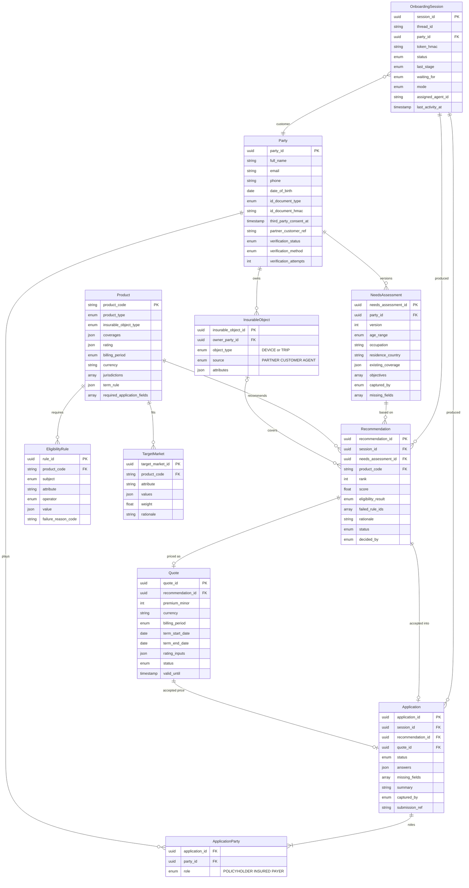

# Data model

Domain entities in the `domain` and `catalog` schemas. Names follow ACORD where one exists (`Party`,
`InsurableObject`, `Quote`, `Policy`) and IDD for suitability (`NeedsAssessment`, `TargetMarket`). Graph state is
separate and described in [state-management.md](state-management.md).

The implementation may keep only the tables and fields the flow needs; this page is the design.

## 1. Entity groups

Entities are grouped by lifetime and by who changes them.

| Group | Entities | Changed by | Lifetime | Personal data |
|---|---|---|---|---|
| Reference (`catalog`) | `Product`, `EligibilityRule`, `TargetMarket` | Operators (seed data) | While a product is on sale | None |
| Customer | `Party`, `NeedsAssessment`, `InsurableObject` | The workflow | The customer relationship | Yes |
| Transaction | `OnboardingSession`, `Recommendation`, `Quote`, `Application`, `ApplicationParty` | The workflow | Each onboarding. Outlives the conversation checkpoint | Yes (`answers`) |
| Result | `Policy` | Contract admin system | The contract term | Out of scope, no fields |

## 2. Relationships

## 3. Key rules

| Entity | Rule |
|---|---|
| `Party` | Created in the identity stage. Other insured persons and payers are created in the application stage and are not verified. The ID number is stored only as an HMAC |
| `NeedsAssessment` | Never edited. A change creates a new `version`; recommendations based on older versions expire |
| `InsurableObject` | Kept separate from the application: eligibility runs before the application exists, it can come from the partner, and one customer can have several. A traveller is a `Party`, not an attribute of the trip |
| `EligibilityRule` | Evaluated by code: `subject.attribute operator value` (operators `EQ`, `IN`, `GTE`, `LTE`, `WITHIN_DAYS`). A failure records its `failure_reason_code` on the recommendation |
| `TargetMarket` | Never excludes; only adds `weight` to the rank score. Its `rationale` is the only ground the LLM gets for explaining a recommendation |
| `Recommendation` | One row per product per run, **including ineligible ones**. Accepting one moves the flow to the application stage |
| `Quote` | One per eligible recommendation. Price computed from `Product.rating` (`TIERED`, `PERCENT`, `PER_TRIP_DAY`, `FLAT`) and object values. Valid for `min(created_at + 24h, term start 00:00)` |
| `Application` | Missing fields = `Product.required_application_fields` − keys of `answers`. Complete when that is empty. `submission_ref` comes from the contract admin system |
| `ApplicationParty` | Exactly one `POLICYHOLDER`, at least one `INSURED` |
| `OnboardingSession` | One per graph thread. Holds the session link HMAC and a progress summary so the agent list does not read checkpoints |

## 4. State transitions

| Moment | `Party.verification_status` | `NeedsAssessment` | `Recommendation.status` | `Quote.status` | `Application.status` |
|---|---|---|---|---|---|
| Session start | `UNVERIFIED` | — | — | — | — |
| Identity done | `VERIFIED` | — | — | — | — |
| Profiling | `VERIFIED` | v1, fields missing | — | — | — |
| Recommendations shown | `VERIFIED` | v1 complete | `PROPOSED` × N | `ISSUED` × eligible | — |
| Customer changes answers | `VERIFIED` | v2 | v1 rows `EXPIRED`, v2 rows `PROPOSED` | v1 rows `EXPIRED`, new `ISSUED` | — |
| Recommendation accepted | `VERIFIED` | v2 | one `ACCEPTED` | that one `ACCEPTED` | `DRAFT` |
| Filling gaps | `VERIFIED` | v2 | `ACCEPTED` | `ACCEPTED` | `INCOMPLETE` |
| Waiting for confirmation | `VERIFIED` | v2 | `ACCEPTED` | `ACCEPTED` | `COMPLETE` |
| Submitted | `VERIFIED` | v2 | `ACCEPTED` | `ACCEPTED` | `SUBMITTED` |

## 5. Product catalog seed

Eight products: two markets × the four product types from the brief. Values are modelled on public products
and are not bolttech's real rates.

| Code | Type | Pricing | Billing | Term |
|---|---|---|---|---|
| `KR-MOB-SWAP` | Mobile | MSRP tiers, ₩5,990–15,990 | Monthly | 36 months from purchase |
| `KR-DEV-LAPTOP` | Device | MSRP tiers, ₩7,200–8,400 | Monthly | 36 months from purchase |
| `KR-EW-HOME` | Extended warranty | Purchase price tiers, ₩4,000–70,000 | One-time | 4 years after manufacturer warranty |
| `KR-TRV-OVERSEAS` | Travel | ₩1,350 per day, min ₩1,850 | Per trip | Departure to return |
| `US-MOB-BOLT` | Mobile | MSRP tiers, $7.99–13.99 | Monthly | 1 month, auto-renew |
| `US-DEV-LAPTOP-2Y` | Device | Purchase price tiers, $20–180 | One-time | 24 months from purchase |
| `US-EW-TV-3Y` | Extended warranty | Purchase price tiers, $50–150 | One-time | 3 years from purchase |
| `US-TRV-SINGLE` | Travel | 6% of trip cost, min $50 | Per trip | Departure to return |

Each product has a residence rule that limits it to its own market, plus product-specific rules (device
category, days since purchase or activation, condition, trip length, and so on).
