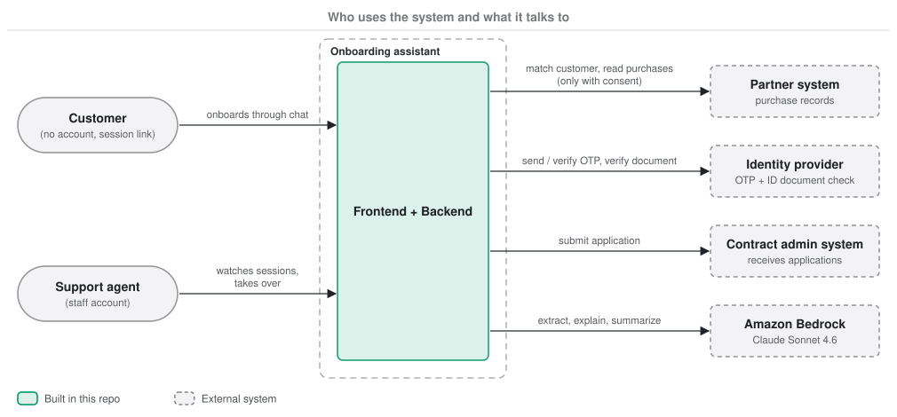
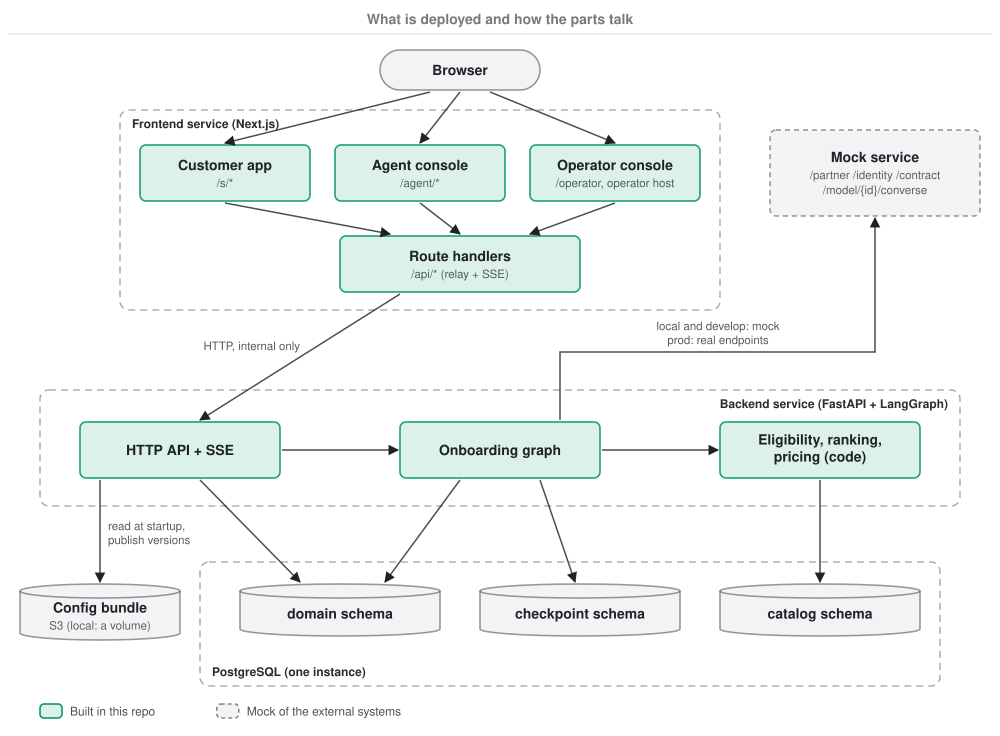
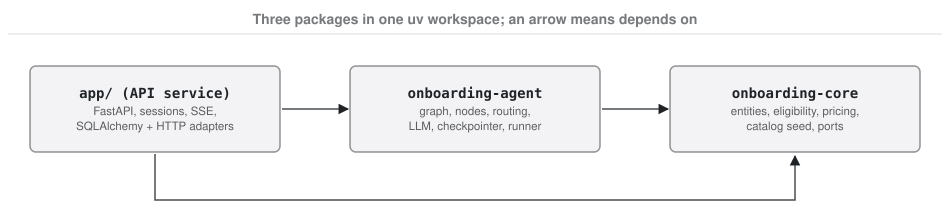
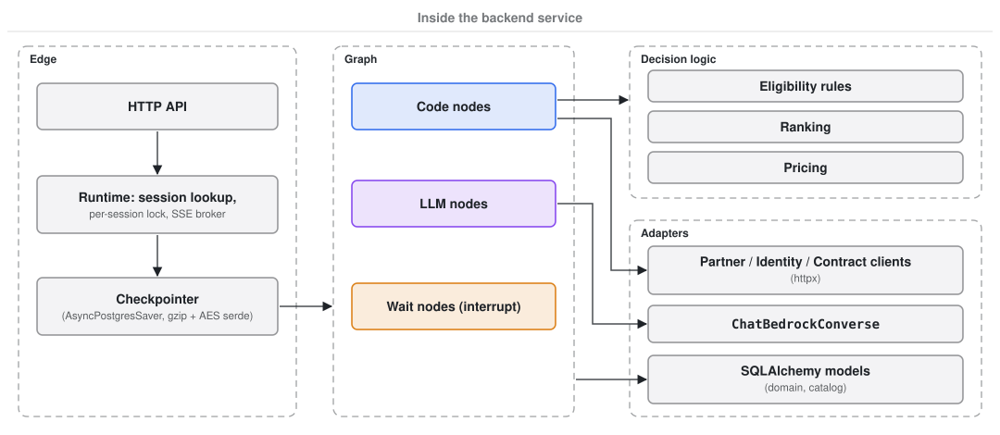

# Solution architecture

This document describes the system at the two outer levels of the C4 model: **context** (who uses it and
what it talks to) and **containers** (what is deployed and how the parts talk). The graph inside the backend
is in [langgraph-design.md](02-langgraph-design.md). The AWS mapping is in [aws-architecture.md](../infra/01-aws-architecture.md).

## 1. System context

Three kinds of people use the system.

| Person | How they get in | What they do |
|---|---|---|
| Customer | The landing page (start on their own, rate-limited per address) or a session link `/s/{token}` from an agent. No account | Goes through the four onboarding stages in a chat |
| Support agent | Agent console `/agent`. Staff login: Cognito at the ALB in develop; a development identity (`agent-demo`) locally, and behind Cognito until the frontend verifies the ALB's signed header | Sees all sessions, opens a new session link, takes over a stuck session, answers on the customer's behalf |
| Operator | Operator console on the operator host (`dev.operator.` / `operator.onboardassist.click`): staff Cognito login in the `operators` group. Or the CLI, as the environment's agent config operator role | Maintains what the agent says and which models it uses: browses and compares config versions, edits one field by field, publishes it as a new version and restarts the backend to load it. See [langgraph-design.md](02-langgraph-design.md#10-models-prompts-and-copy-the-config-bundle) |

The brief says the assistant "helps support agents guide customers" and also asks for a "customer onboarding
interface". We support both: the customer drives the chat, and an agent can step in at any point. See
[assumptions.md](../decisions/assumptions.md).

There are four external systems.

| System | Used for | Called by node |
|---|---|---|
| Partner | Match the customer to a partner record; read device purchases | `verify_identity`, `fetch_purchases` |
| Identity | Send an OTP (`verify_identity`); verify the OTP; verify an ID document number | `verify_identity`, `check_otp`, `check_document` |
| Contract admin | Receive the finished application and return a submission reference | `submit_application` |
| Amazon Bedrock | LLM calls through the Converse API | the five LLM nodes |

**One mock service, with the same API shapes as the real systems.** It serves partner, identity, contract admin
and the Bedrock Converse API.

| Where | Partner, identity, contract admin | Bedrock |
|---|---|---|
| Local (`docker compose`) | Mock | Mock (`BEDROCK_ENDPOINT_URL=http://mock:8080`) |
| Backend tests | In-process fakes built from the same seed file | In-process fake LLM |
| develop (AWS) | Mock, as its own ECS service | Real Bedrock through the VPC endpoint (`BEDROCK_ENDPOINT_URL` unset) |
| prod (AWS) | Real endpoints. They do not exist yet, so Terraform sets `https://*.invalid` placeholders | Real Bedrock |

The backend code is the same everywhere; only environment variables change (`PARTNER_API_URL`,
`IDENTITY_API_URL`, `CONTRACT_API_URL`, `BEDROCK_ENDPOINT_URL`). There is no "am I talking to a mock?" branch in
the code.

## 2. Containers

The brief requires two services that are deployed separately. We keep that split.

| Container | Technology | Responsibility |
|---|---|---|
| Frontend | Next.js 16 (App Router, TypeScript, pnpm), standalone Node server | Three apps in one service: the customer app (`/s/*`), the agent console (`/agent`) and the operator console (`/operator`, served at `/` on the operator host). `proxy.ts` (Next.js 16's middleware) turns the `/s/{token}` link into a session cookie and sends each console to its own host. Route handlers under `/api/*` relay every call, including SSE, to the backend; the browser never calls the backend directly. `/healthz` proxies to the backend's health check, `/api/healthz` checks only the frontend, and `/api/agent/me` returns the signed-in agent's ID |
| Backend | FastAPI + LangGraph, Python 3.13, uv | HTTP API, the onboarding graph, eligibility, ranking and pricing, persistence, calls to external systems. Creates its tables and seeds the catalog at startup |
| PostgreSQL | PostgreSQL 16 (RDS in AWS) | Three schemas: `checkpoint` (graph state), `domain` (customer and transaction entities), `catalog` (products, rules) |
| Config bundle | S3, one bucket per environment (locally a Docker volume) | What the agent says and which models it uses, as immutable versions. The backend reads one version at startup and, for the operator console, publishes new ones (create-only). See [langgraph-design.md](02-langgraph-design.md#10-models-prompts-and-copy-the-config-bundle) |
| Mock | FastAPI | One app for partner, identity, contract admin and Bedrock Converse, plus fault injection (`/_mock/faults`). Local and develop only |

### Backend packages

The backend is one deployable service built from three Python packages in a uv workspace (`backend/`). The
agent and the domain are libraries; the API service depends on them, never the other way round.

| Package | Path | Owns | Must not import |
|---|---|---|---|
| `onboarding-core` | `backend/packages/core` | Domain entities as plain dataclasses, the profiling, eligibility, pricing and application rules, the product lines (device, travel), the catalog seed, and the **ports** (`onboarding_core.ports`): the `UnitOfWork` with one repository per domain, the partner/identity/contract gateways | SQLAlchemy, LangGraph, FastAPI, `app` |
| `onboarding-agent` | `backend/packages/agent` | The LangGraph graph (one module per domain under `flows/`), copy, LLM access, the encrypted checkpointer, and `AgentRunner` (start, resume, snapshot, route a failed run to handoff) | SQLAlchemy, FastAPI, `app` |
| API service | `backend/app` | HTTP API and SSE, session tokens and the `OnboardingSession` mirror, and the **adapters**: the SQLAlchemy mapping of the core entities (`app/db/models.py`) and unit of work (`app/db/uow.py`), the HTTP clients. `app/main.py` is the composition root that plugs the adapters into the agent | — |

The agent reads and writes the domain DB only through `UnitOfWork`. Core entities are mapped onto the tables
imperatively, so a node changes an entity's fields and the unit of work persists them when its block exits.
`tests/test_boundaries.py` fails the build if a package imports across its boundary.

Why the three schemas share one instance: they differ in lifetime and access, but not enough to justify
three databases for this scope. Checkpoints are only useful while a session is alive (30-day inactivity limit),
domain entities live as long as the customer relationship, and the catalog is read-only for the graph.

Why the customer app and the two consoles share one service: the brief asks for exactly two services. The
three apps have separate layouts, routes, hosts and auth rules, so they behave as separate apps to users while the
deployment stays at two units.

### Frontend-to-backend communication

- The browser talks only to the frontend (through the ALB in AWS).
- The frontend's route handlers call the backend at `BACKEND_URL` (`http://backend:8000`: Docker Compose
  locally, ECS Service Connect in AWS).
- Chat updates are streamed with **server-sent events**. The backend emits SSE, and the frontend passes the
  stream through unchanged. Events: `session.updated`, `message.appended`, `prompt.updated`, `entity.updated`,
  and a `: ping` comment every 15 s.
- Agent identity is resolved once at the frontend and passed to the backend as `X-Agent-Id`. Locally (and in
  develop for now) `AGENT_DEV_AUTH=true` makes every agent `agent-demo`. The customer's session token is read from
  the httpOnly cookie and passed as `X-Session-Token`. The backend checks the token against its stored HMAC and
  trusts `X-Agent-Id` because only the frontend can reach it. See [networking.md](../infra/02-networking.md#5-authentication).
- Operator identity works the same way, as `X-Operator-Id`. In AWS the frontend verifies the operator's Cognito
  login (the operator app client, `operators` group) before sending it; locally `OPERATOR_DEV_AUTH=true` makes
  every operator `operator-demo`. The operator API answers 404 on the app and agent hosts.
- Sending input returns `202 Accepted`. The graph runs in the background and the result arrives over SSE.

The API contract is in [`CONTRACTS.md`](../../CONTRACTS.md) §3. Main endpoints:

| Caller | Endpoint | Purpose |
|---|---|---|
| Landing page | `POST /api/public/sessions` | Start a session on the customer's own: 5 per client address and 200 in total per hour, `429` with `retry_after` over a limit. The browser reaches it through the frontend's `POST /api/start`, which sets the session cookie itself |
| Agent console | `POST /api/sessions` | Create a session and return the customer link `/s/{token}`. The browser reaches it only through the frontend's `POST /api/agent/sessions`, which the ALB's Cognito rule covers |
| Customer app | `GET /api/customer/session`, `POST .../input`, `GET .../stream` | Read the session, send input, stream updates |
| Agent console | `GET /api/agent/sessions`, `GET /api/agent/sessions/{id}`, `POST .../assign`, `POST .../input`, `GET /api/agent/sessions/{id}/stream`, `GET /api/agent/stream` | Session list, session detail with entities, take over, answer as agent, stream one session or all |
| Agent console | `GET /api/agent/me` (frontend only) | Who the signed-in agent is, for "Assign to me" |
| Operator console | `GET /api/operator/config`, `GET /api/operator/config/versions`, `GET .../versions/{version}` | The live version, the published versions, one version's files |
| Operator console | `POST /api/operator/config/validate`, `POST /api/operator/config/versions`, `POST /api/operator/restart` | Check a draft, publish it as the next patch or minor, restart the backend to load it |
| Operator console | `GET /api/operator/graph` | The agent loop's nodes and edges, read from the flow code |
| Deploy smoke test | `GET /healthz` | Frontend relays to the backend's `/healthz` |

## 3. Inside the backend

The left column is why sessions can be resumed: the API receives input, finds the thread for the session,
and the checkpointer loads the paused state. SSE events reach every backend replica through Postgres `LISTEN/NOTIFY`
(`SSE_BROKER=postgres`; local runs keep the in-memory broker). The per-session lock still lives in the backend
process, so the backend runs as a single replica for now (see [tradeoffs.md](../decisions/tradeoffs.md#4-application-design)).

Eligibility, ranking and pricing are plain code, not LLM calls. An agent must be able to see **why** a product
was excluded (`EligibilityRule.failure_reason_code`) and **why** a price is what it is (`Quote.rating_inputs`).
A sentence written by an LLM cannot be traced back like that. The LLM only extracts values from what people
say and explains results the code already produced.

## 4. Scope boundary

The system ends when the contract admin system returns a submission reference
(`Application.submission_ref`). Underwriting and policy issuance belong to the contract admin system and are out
of scope. The `Policy` entity is named in the model but has no fields.
