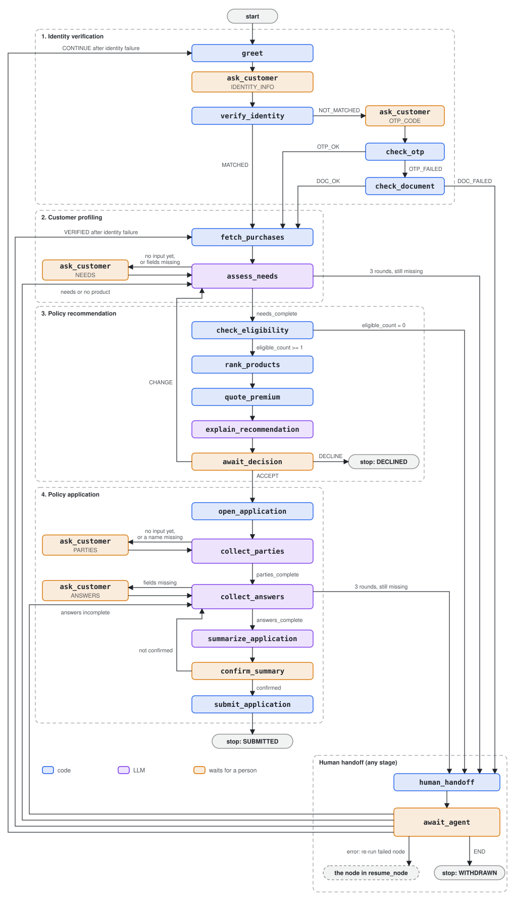

# LangGraph design

The backend runs one LangGraph graph per onboarding session. One session is one **thread**. The graph covers
the four stages the brief lists and pauses whenever it needs a person.

What the graph stores and how routing reads it is in [state-management.md](03-state-management.md). The code is in
the `onboarding-agent` package (`backend/packages/agent/src/onboarding_agent/`): one module per domain under
`flows/` holds its nodes and their edge functions, `build.py` assembles them into the graph, and `runner.py` is
the entry point the API service drives. Nodes reach the domain DB and external systems only through the ports
in `onboarding_core.ports` (see [solution-architecture.md](01-solution-architecture.md#backend-packages)). How the
code is split, and how to add to it, is in [§9](#9-code-by-domain).

## 1. The four stages

| Stage | What the customer does | What the system does | New entities | Stage ends when |
|---|---|---|---|---|
| 1. Identity verification | Gives name, email, phone, ID document, and consent to a partner lookup. Enters an OTP if asked | Partner match → OTP → ID document. Two failures hand off to an agent | `Party` (created empty with the session, filled here) | `Party.verification_status = VERIFIED` |
| 2. Customer profiling | Describes themselves and what they want to cover, in free text | Loads device purchases from the partner (with consent). LLM extracts profile fields. Code decides what is still missing and asks only for that | `NeedsAssessment` (versioned), `InsurableObject` | The assessment has no missing fields |
| 3. Policy recommendation | Accepts, declines, or changes their answers | Code checks eligibility, ranks and prices products. LLM explains the ranked result | `Recommendation`, `Quote` | One recommendation is `ACCEPTED` |
| 4. Policy application | Says who is insured and who pays, answers product questions, confirms the summary | Pre-fills answers it already knows, asks for the rest, writes a summary, submits | `Application`, `ApplicationParty`, other `Party` rows | `Application.status = SUBMITTED` with a submission reference |

Identity comes first. No profiling happens until identity is verified. See [assumptions.md](../decisions/assumptions.md).

## 2. Nodes by type

Nodes are split by who decides.

| Type | What it does | Nodes |
|---|---|---|
| **Code** | Deterministic checks, calculations, external calls, writes | `greet`, `verify_identity`, `check_otp`, `check_document`, `fetch_purchases`, `check_eligibility`, `rank_products`, `quote_premium`, `open_application`, `submit_application`, `human_handoff` |
| **LLM** | Extracts values from what people say, or writes text | `assess_needs`, `explain_recommendation`, `collect_parties`, `collect_answers`, `summarize_application` |
| **Wait** | Pauses with `interrupt()` until a person answers | `ask_customer`, `await_decision`, `confirm_summary`, `await_agent` |

A node that needs free-form input asks the question itself: it appends the message, sets `waiting_for`, and
routes to `ask_customer`. `ask_customer` is one node reused for every "please tell me X" pause
(`IDENTITY_INFO`, `OTP_CODE`, `NEEDS`, `PARTIES`, `ANSWERS`). It interrupts, records the answer, sets
`last_input` to the kind it received, and routes back to the node that handles that kind. Decisions, the summary
confirmation and agent resolutions have their own wait nodes because they carry structured data.

### What each node does

| Node | Stage | Reads | Writes | External call |
|---|---|---|---|---|
| `greet` | 1 | Market | First message, `waiting_for = IDENTITY_INFO` | — |
| `ask_customer` | all | The resumed input | For `IDENTITY_INFO`: `Party` contact fields, consent time, ID number (AES-encrypted and HMAC), optional date of birth. For `OTP_CODE`: a transient `otp_code` in state. Otherwise the text as a message | — |
| `verify_identity` | 1 | `Party` | With consent and a match: `VERIFIED`, `PARTNER_MATCH`, partner ref, date of birth. Otherwise sends an OTP | Partner match (only with consent). If no match: identity, send OTP |
| `check_otp` | 1 | `otp_code`, `otp_request_id` | `Party.verification_*`; clears `otp_code` | Identity: verify OTP |
| `check_document` | 1 | ID number from `Party` (decrypted) | `Party.verification_*` | Identity: verify document |
| `fetch_purchases` | 2 | `Party.partner_customer_ref`, consent | `InsurableObject` (`source = PARTNER`) | Partner: purchases. Does nothing without consent or match |
| `assess_needs` | 2 | Customer's `NEEDS` messages, current assessment, partner devices | `NeedsAssessment`, and on completion a device or trip `InsurableObject` described by the customer | Bedrock (`NeedsExtraction`) |
| `check_eligibility` | 3 | Catalog rules for the session's market, assessment, objects | One `Recommendation` per product, **including ineligible ones** with failed rules | — |
| `rank_products` | 3 | `TargetMarket` weights | `Recommendation.rank`, `score` | — |
| `quote_premium` | 3 | `Product.rating`, `term_rule`, object values | `Quote` per eligible recommendation. A rating error makes that product ineligible | — |
| `explain_recommendation` | 3 | Ranked, priced recommendations; `TargetMarket.rationale` | `Recommendation.rationale` | Bedrock (`RecommendationRationale`) |
| `await_decision` | 3 | `ACCEPT` / `DECLINE` / `CHANGE` | `Recommendation.status`, `Quote.status`, `decided_by` | — |
| `open_application` | 4 | Accepted recommendation and quote | `Application` (`DRAFT`) with answers pre-filled from the object and the customer. Re-prices the quote if it expired | — |
| `collect_parties` | 4 | Customer's `PARTIES` text | `ApplicationParty` rows, new `Party` rows for others | Bedrock (`PartiesExtraction`) |
| `collect_answers` | 4 | Customer's `ANSWERS` text, `Product.required_application_fields` | `Application.answers`, `missing_fields`, status | Bedrock (`AnswersExtraction`), only when there is new text |
| `summarize_application` | 4 | Complete application | `Application.summary` | Bedrock (`ApplicationSummary`) |
| `confirm_summary` | 4 | `confirmed`, optional correction text | — | — |
| `submit_application` | 4 | Complete application | `Application.submission_ref`, `SUBMITTED` | Contract admin, with `Idempotency-Key` |
| `human_handoff` | any | `last_error`, `handoff_reason` | `stage = HANDOFF`, `waiting_for = AGENT`, where to resume, a message | — |
| `await_agent` | any | Agent resolution | `Party.verification_method = AGENT` on `VERIFIED` after an identity handoff | — |

`quote_premium` runs before `explain_recommendation` so the explanation can mention the price.

## 3. Graph



Blue is code, purple is LLM, orange is a wait node. Not drawn: every node routes to `human_handoff` when
`last_error` is set, and `quote_premium` also hands off if rating errors leave no eligible product.

### Conditional edges

Every node has a conditional edge. Every routing function reads **only the state**, never the database, so
routing can be replayed from a checkpoint and tested without a database (`backend/packages/agent/tests/test_routing.py`).

| After | Reads | Branches |
|---|---|---|
| `ask_customer` | `last_input` | `IDENTITY_INFO` → `verify_identity`; `OTP_CODE` → `check_otp`; `NEEDS` → `assess_needs`; `PARTIES` → `collect_parties`; `ANSWERS` → `collect_answers` |
| `verify_identity` | `identity_result` | `MATCHED` → `fetch_purchases`; otherwise wait for the OTP |
| `check_otp` | `identity_result` | `OTP_OK` → `fetch_purchases`; otherwise `check_document` |
| `check_document` | `identity_result` | `DOC_OK` → `fetch_purchases`; otherwise `human_handoff` |
| `assess_needs` | `needs_complete`, `handoff_reason` | complete → `check_eligibility`; `NEEDS_INCOMPLETE` → `human_handoff`; otherwise ask again |
| `check_eligibility`, `quote_premium` | `eligible_count` | 0 → `human_handoff`; ≥ 1 → next node |
| `await_decision` | `decision` | `ACCEPT` → `open_application`; `CHANGE` → `assess_needs`; `DECLINE` → end |
| `collect_parties` | `parties_complete` | true → `collect_answers`; false → ask again |
| `collect_answers` | `answers_complete`, `handoff_reason` | complete → `summarize_application`; `ANSWERS_INCOMPLETE` or `NO_ELIGIBLE_PRODUCT` → `human_handoff`; otherwise ask again |
| `confirm_summary` | `confirmed`, `correcting`, `handoff_reason` | true → `submit_application`; a rejection with a correction → `collect_parties` (then `collect_answers` with the same message); without one → `collect_answers`; `SUMMARY_REJECTED` → `human_handoff` |
| `await_agent` | `handoff_resolution`, `handoff_reason`, `resume_node` | See [§5](#5-human-handoff) |
| any node | `last_error` | set → `human_handoff` |

`fetch_purchases` has no branch. Consent (`Party.third_party_consent_at`) is a precondition inside the node:
without consent or without a partner match it does nothing and passes on. The customer then describes the
device in their own words.

Identity routing uses **results, not counters**. The number of failed identity attempts lives in
`Party.verification_attempts` in the database. The state holds only the last result (`OTP_FAILED`), and the graph
shape decides what follows: `OTP_FAILED` always goes to the document check, `DOC_FAILED` always goes to an agent.
That is how "two failures hand off" is enforced.

The question loops are the exception. `needs_rounds` and `answers_rounds` count answers that still left
fields missing, and `confirm_rejections` counts summaries the customer rejected. After **3** the node sets
`handoff_reason` (`NEEDS_INCOMPLETE`, `ANSWERS_INCOMPLETE` or `SUMMARY_REJECTED`) and the session goes to an
agent instead of asking forever.

Eligibility runs on assumptions when the customer has not said everything: a device is new, undamaged and
bought (for a phone, activated) today. The assumptions are recorded in `assumed_fields` and never copied into
the application, which asks for the real values. When the customer gives them, `collect_answers` writes them
onto the insurable object and checks the product again; if the real values rule it out (a phone activated five
months ago), the session goes to an agent with `NO_ELIGIBLE_PRODUCT` instead of submitting.

"Today" is the market's calendar day (`Asia/Seoul` for KR, `America/New_York` for US), not the UTC date: a
Korean customer who bought a TV at 08:00 in Seoul bought it today, though it is still yesterday in UTC.

### The loop back

When the customer chooses `CHANGE` after seeing recommendations, all recommendations and quotes of that run
become `EXPIRED` and the flow returns to `assess_needs`. Because the current assessment is complete,
`assess_needs` writes a **new** `NeedsAssessment` version, and the recommendation stage runs again. If the
customer typed what changed together with `CHANGE`, that text is used as the next needs answer; otherwise
the graph asks what changed. Old versions are kept so the agent can see what each recommendation was based on.

## 4. Interrupt and resume

1. A wait node calls `interrupt({"waiting_for": ...})`. The node before it has already appended the question
   to `messages`.
2. The checkpointer saves the state and the graph run stops.
3. The backend copies `stage`, `waiting_for` (from the interrupt payload) and the next node into the
   `OnboardingSession` row and publishes SSE events (`session.updated`, `prompt.updated`, plus
   `message.appended` and `entity.updated` while the graph ran). The frontend shows the input that matches
   `waiting_for`. This is the "workflow visibility" the brief asks for.
4. When input arrives (`POST .../input` with `{type, data}`), the API validates `data` for that `type`, rejects
   it with `409` if `type` is not the current `waiting_for` or the session is still processing, and returns `202`.
   The graph resumes the same thread in a background task with
   `Command(resume=data, update={"actor": ..., "mode": ...})`.
5. The paused node receives the value and the graph runs until the next wait node or the end.

The same mechanism covers three cases:

| Case | How |
|---|---|
| Multi-turn conversation | Every question is a wait; every answer is a resume |
| Customer leaves and comes back | The graph stays paused in the checkpoint. The same link resumes from the last wait node |
| Agent takes over | The agent resumes the same thread with `actor = AGENT` |

## 5. Human handoff

The handoff is two nodes. `human_handoff` is a code node: it sets `stage = HANDOFF`, `waiting_for = AGENT`,
`handoff_reason`, and where to resume (`resume_stage`, and `resume_node` for errors), and adds a message.
`await_agent` is the wait node that interrupts. LangGraph re-runs an interrupted node from the top when it
resumes, so keeping the state changes in a separate node before the pause means they are saved once and are
visible to the agent while the session waits.

It is reached for five reasons:

| `handoff_reason` | Trigger | Example |
|---|---|---|
| `IDENTITY_FAILED` | OTP failed, then the document check failed | Seed customer D |
| `NO_ELIGIBLE_PRODUCT` | No product passed eligibility (or pricing) | The customer is told why; ineligible recommendations keep their failure reasons |
| `NEEDS_INCOMPLETE` | 3 needs answers still left fields missing | Seed customer D after an agent verified them |
| `ANSWERS_INCOMPLETE` | 3 application answers still left fields missing | |
| `SUMMARY_REJECTED` | The customer rejected 3 summaries | A correction the agent kept getting wrong |
| `ERROR` | A node ran out of retries (`last_error` set) | Bedrock throttling, a timeout in an external system |

The session's status becomes `HANDOFF` and it moves to the top of the agent's session list. The agent opens the
session, sees the conversation, the current node, the entities and the error message, and resumes with an
`AGENT` input `{resolution, note?}`:

| Resolution | After `IDENTITY_FAILED` | After `NEEDS_INCOMPLETE` / `NO_ELIGIBLE_PRODUCT` | After `ANSWERS_INCOMPLETE` | After `SUMMARY_REJECTED` | After `ERROR` |
|---|---|---|---|---|---|
| `VERIFIED` | `verification_method = AGENT`; continues to profiling | Same as `CONTINUE` | Same as `CONTINUE` | Same as `CONTINUE` | Same as `CONTINUE` |
| `CONTINUE` | Identity starts again; attempts reset | Asks for needs again; round counter reset | Asks for answers again; round counter reset | A fresh summary to confirm; rejection counter reset | Re-runs the failed node with the input it had |
| `END` | Session ends, `stage = WITHDRAWN` | Same | Same | Same | Same |

Taking over a session (`POST .../assign`) sets `assigned_agent_id` and `mode = ASSIST`. Assignment is recorded,
not enforced: any signed-in agent can send input. Everything sent through the agent endpoints runs with
`actor = AGENT` and is recorded as `captured_by` / `decided_by = AGENT` on the entities.

## 6. Retries and error handling

| Failure | Handling |
|---|---|
| LLM or external call fails (timeout, 5xx, 429 / `ThrottlingException`, malformed LLM output) | LangGraph `RetryPolicy` on the ten nodes that call the LLM or an external system: 3 attempts, exponential backoff from 0.5 s (`RETRY_MAX_ATTEMPTS`, `RETRY_INITIAL_INTERVAL`). Client errors other than 429 and programming errors are not retried |
| Retries used up | The runtime catches the exception, writes `last_error = {node, kind, attempts}` into the state as that node, and the node's edge routes to `human_handoff` (`ERROR`). The state is saved up to the last finished node, so nobody starts over. `CONTINUE` re-runs the failed node |
| LLM output does not match the schema | Raised as an error inside the node, so it is retried like any other |
| Customer input is incomplete | Not an error. Code computes the missing fields (the LLM's own `missing_fields` is only advisory) and asks for just those, up to 3 rounds |
| Quote expired (`valid_until` passed, for example after a long pause) | `open_application` re-prices the accepted product, marks the old quote `EXPIRED` and uses the new one |
| Node crashes after writing but before its checkpoint | On resume the node runs again. All writes are idempotent (deterministic IDs, upserts, `Idempotency-Key` on submission). See [state-management.md](03-state-management.md#7-idempotent-writes) |
| Customer or agent stops | `DECLINE` ends the session as `DECLINED`. An agent's `END` ends it as `WITHDRAWN`. There is no customer "withdraw" button |

Failures can be triggered on demand with the mock's `POST /_mock/faults {target, kind, count}` to show
retries and handoff. See [demo.md](../guides/demo.md#3-error-handling).

## 7. LLM use

All LLM calls go through `langchain-aws` `ChatBedrockConverse` to the Bedrock Converse API. Each LLM node has
one Pydantic output schema and uses `with_structured_output` (`function_calling` method: the schema is passed as
a Converse tool and the model answers with a `toolUse` block). Which model a node uses, with which arguments, and
its prompt come from the config bundle ([§10](#10-models-prompts-and-copy-the-config-bundle)); the baseline gives
every node `global.anthropic.claude-sonnet-4-6` (global cross-region inference from `ap-northeast-2`) at
temperature 0.

| Node | Output schema |
|---|---|
| `assess_needs` | `NeedsExtraction` |
| `explain_recommendation` | `RecommendationRationale` |
| `collect_parties` | `PartiesExtraction` |
| `collect_answers` | `AnswersExtraction` |
| `summarize_application` | `ApplicationSummary` |

The LLM never decides eligibility, rank, price or completeness. `explain_recommendation` is given the ranked,
priced result and the catalog's `TargetMarket.rationale` sentences as its only grounds, so it cannot invent
reasons. If it returns nothing for a product, the matched rationale sentences are used as the reason.

## 8. How the six LangGraph requirements are met

| Requirement | Where |
|---|---|
| **State management** | Typed `OnboardingState` with reducers, saved after every node by `AsyncPostgresSaver`. Entity values live in the domain DB, the state holds their IDs. See [state-management.md](03-state-management.md) |
| **Conditional routing** | A conditional edge after every node, driven by routing signals in state (`last_input`, `identity_result`, `needs_complete`, `eligible_count`, `decision`, `parties_complete`, `answers_complete`, `confirmed`, `handoff_reason`, `handoff_resolution`, `last_error`) |
| **Multi-turn workflows** | Wait nodes use `interrupt()`; each answer resumes the same thread. Loops ask again only for missing fields (profiling, parties, answers), capped at 3 rounds |
| **Context awareness** | `assess_needs` reads all of the customer's needs answers plus the values captured so far; `collect_answers` reads the answers so far and what is still missing. A later answer fills gaps instead of starting over. Partner purchases pre-fill the device, and verified data pre-fills application answers, so the customer is not asked twice |
| **Workflow transitions** | `stage` moves IDENTITY → PROFILING → RECOMMENDATION → APPLICATION → SUBMITTED, with exits to HANDOFF, DECLINED, WITHDRAWN. The `CHANGE` edge moves back from recommendation to profiling and expires old recommendations. Each transition is mirrored to `OnboardingSession` and pushed to the UI over SSE |
| **Error handling** | Per-node retry with backoff, `last_error` → `human_handoff`, loop guards, idempotent writes and idempotent submission, fault injection in the mock to show all of this |

## 9. Code by domain

The graph is **one flat graph** assembled from domain modules. It is not built from LangGraph subgraphs. Node
names and state fields are checkpoint data: a session paused today resumes against tomorrow's release only if
they still exist. A flat graph keeps them stable while the code is split. It also keeps error recovery
(`resume_node`), SSE streaming and the agent console's `current_node` working as they are.

| Module (`onboarding_agent/flows/`) | Nodes | Declares |
|---|---|---|
| `conversation` | `greet`, `ask_customer` | built from the stages' `inputs` |
| `identity` | `verify_identity`, `check_otp`, `check_document` | inputs `IDENTITY_INFO`, `OTP_CODE` (with recorders that store them); handoff `IDENTITY_FAILED` |
| `profiling` | `fetch_purchases`, `assess_needs` | input `NEEDS`; handoff `NEEDS_INCOMPLETE` |
| `recommendation` | `check_eligibility`, `rank_products`, `quote_premium`, `explain_recommendation`, `await_decision` | handoff `NO_ELIGIBLE_PRODUCT` (back to profiling) |
| `application` | `open_application`, `collect_parties`, `collect_answers`, `summarize_application`, `confirm_summary`, `submit_application` | inputs `PARTIES`, `ANSWERS`; handoffs `ANSWERS_INCOMPLETE`, `SUMMARY_REJECTED` |
| `handoff` | `human_handoff`, `await_agent` | built from the stages' `handoffs`, plus `ERROR` |

Each module exports a `DomainModule`:
- **Nodes and routing**: its nodes, one router per node, and which nodes retry.
- **`inputs`**: the kinds of free-form answer it asks `ask_customer` for. Each kind names the node that handles it and, optionally, a recorder that stores it.
- **`handoffs`**: the handoff reasons it raises. Each reason names where the session resumes and, optionally, a resolver that applies the agent's resolution.

`ask_customer` and `await_agent` only dispatch through these registries, so they need no changes when a domain
is added. A key can be claimed only once.

Product differences are not in the flow. Device and travel are **product lines** in `onboarding-core`
(`onboarding_core/product_lines/`). Each line declares:
- the objectives that call for it and the needs it requires per market
- how to build the insured object's attributes
- the application answers it can prefill, the aliases the LLM may use, and its field labels

The profiling and application rules loop over the registered lines.

To add a product line:
1. Write a `ProductLine` module and register it in `LINES`.
2. Add its products to the catalog seed.
3. Add a field for its needs to `NeedsAssessment` and to the LLM's `NeedsExtraction`. Both still have fixed `device` and `trip` fields.

**What guards a refactor:**

| Test | Checks |
|---|---|
| `tests/test_golden.py` | Eleven scripted flows, including a KR session in English and a language switch mid-session. Each records the node path, every turn's state, messages and prompt, the entities, the LLM calls with the language each was told to reply in, and the external calls, all pinned to `tests/golden/*.json`. Regenerate with `UPDATE_GOLDEN=1` only for an intended behavior change, and review the diff |
| `test_node_names_are_stable`, `test_state_fields_are_stable` | Pin the checkpointed names. Renaming a node or a field is a migration, not a refactor |
| `test_domain_registries_cover_the_state_vocabulary` | Every `WaitingFor` input has a handler node, and every `HandoffReason` has a resolution |

## 10. Models, prompts and copy: the config bundle

The code decides; what the agent says and asks the LLM, and which model it asks, is data. It lives in a
**config bundle** (`onboarding_agent.config`):

```text
<base>/<semver>/config.json       languages, model profiles, system prompt, field labels, billing units
<base>/<semver>/flows/<flow>.json  llm: node -> model profile + prompt parts; copy: key -> text per language
```

`<base>` is any fsspec location: a local directory, `s3://bucket/prefix`, `memory://...`. In AWS each environment
has its own bucket. The backend
reads the bundle **once, at startup** (`AGENT_CONFIG_URI`, `AGENT_CONFIG_VERSION`). A version is exact (`1.2.0`)
or a prefix (`1`, `1.2`) that means the highest published match. With no URI, it uses the baseline bundle shipped
in the agent package, which is what tests use; `docker compose` seeds a volume with it (`AGENT_CONFIG_SEED`) so the
console can publish locally.

**Validation.** Each domain module declares what it reads (`DomainModule.texts`): its copy keys, its LLM nodes'
prompt parts, and the placeholders the code passes to each. A bundle is checked against those declarations when
it loads, and every problem is reported at once, so a bad bundle stops the backend at startup instead of failing
a customer's turn. Checks cover:
- a missing or unknown key
- a placeholder the code does not pass
- a missing language
- an unknown model profile or argument
- a model id the IAM policy does not allow (`LLM_ALLOWED_MODEL_IDS`)

Templates take plain names only (`{fields}`): the bundle is edited outside the codebase, so a template must not
reach into the objects it is rendered with.

**Versions are the contract.**

| Change | Version |
|---|---|
| Edit a prompt, a model or its arguments, or copy | patch or minor |
| Add a language, a label or a copy key | minor |
| Remove a language or a key, or change what the code passes | major: needs an agent built for that major (`CONFIG_MAJOR`) |

Every way of publishing enforces this against what is already published:
- it never overwrites a version
- the new version must be higher than the latest one in its major
- within a major it may not drop a language, key, node or label

It writes `config.json` last, because a version counts as published once its `config.json` exists, and a
`release.json` with who published it, when, from which version and why.

The **operator** publishes in one of three ways:

| Way | How |
|---|---|
| Operator console | On the operator host: browse versions, compare two, edit a new version field by field (model profiles, prompts, copy per language, labels, languages), validate, publish it as the next patch or minor, restart the backend. The agent loop beside it highlights the nodes an entry or a change reaches, from `GET /api/operator/graph` (read from the flow code) |
| CLI | `python -m onboarding_agent.config pull <repo> <dir>`, edit, `push <dir> <repo> --bump patch|minor --notes "..."` (picks the next version), then restart the backend |
| Python | `Bundle.from_pretrained(repo).save_pretrained(dir)`, edit, `Bundle.from_pretrained(dir).push_to_hub(repo, bump="minor", notes="...")` |

Publishing is create-only everywhere: every write carries `If-None-Match: *`, and both the backend's task role
(behind the console) and the environment's agent config operator role (the CLI; Terraform output
`agent_config_operator_role_arn`) are denied any other kind of put, and neither may delete. Both may restart the
backend service:

```bash
aws ecs update-service --cluster <cluster> --service <name>-backend --force-new-deployment
```

**Languages are data.** A bundle declares its languages. The API accepts a session locale only if the loaded
bundle has it (`GET /api/languages`). A session in a language the bundle lacks falls back to the bundle's default
language. The customer UI's own strings are the frontend's (next-intl), so a new language needs those too.

The golden transcripts (`tests/test_golden.py`) record every message and every LLM prompt verbatim. Moving the
text out of the code left them unchanged.
