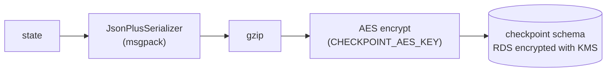

# State management

This is the state model for the onboarding graph: what the graph passes between nodes, what conditional
edges read, what is saved when the graph pauses, and how personal data is protected.

## 1. Three principles

1. **IDs in state, values in the database.** A node writes entity values to the domain schema and returns only
   the entity's ID to the state. Keeping one value in two places means they drift apart eventually.
2. **Everything a conditional edge reads is in the state.** Routing functions never query the database.
   Branching can be replayed from a checkpoint alone, and routing can be unit-tested without a database.
3. **Wait nodes pause with `interrupt()`.** A person's input resumes the same thread with
   `Command(resume=...)`. Session resume and agent handoff use this same mechanism.

## 2. Where data lives

| Store | Holds | Lifetime | Written by |
|---|---|---|---|
| Graph checkpoint (`checkpoint` schema) | `OnboardingState`, below | One onboarding session. Meant to be deleted after 30 days without activity (cleanup job not built yet) | `AsyncPostgresSaver`, after every node |
| Domain DB (`domain` schema) | Customer and transaction entities, session links | The customer relationship | Nodes and the API, through SQLAlchemy |
| Catalog (`catalog` schema) | `Product`, `EligibilityRule`, `TargetMarket` | While a product is on sale | The backend at startup (idempotent seed). The graph only reads it |

One thread is one onboarding session. When a session is created (`POST /api/sessions`) the backend creates an
empty `Party`, the `OnboardingSession` row, and the thread (`thread_id` = session ID), then runs the graph to its
first question. The customer and the agent open the same thread.

## 3. State schema

This is `backend/app/graph/state.py`, shortened. IDs are strings.

```python
class OnboardingState(TypedDict, total=False):
    # conversation
    messages: Annotated[list[AnyMessage], add_messages]
    actor: Literal["CUSTOMER", "AGENT"]
    mode: Literal["AUTO", "ASSIST"]

    # session context (ids and market only)
    session_id: str
    party_id: str
    market: Literal["KR", "US"]

    # progress
    stage: Literal["IDENTITY", "PROFILING", "RECOMMENDATION", "APPLICATION",
                   "SUBMITTED", "HANDOFF", "DECLINED", "WITHDRAWN"]
    waiting_for: Literal["IDENTITY_INFO", "OTP_CODE", "NEEDS", "DECISION",
                         "PARTIES", "ANSWERS", "CONFIRM", "AGENT"] | None
    last_input: ... | None                    # which input ask_customer just received

    # entity references (values live in the domain DB)
    needs_assessment_id: str | None           # latest version
    insurable_object_ids: list[str]
    recommendation_ids: list[str]
    quote_ids: dict[str, str]                 # recommendation_id -> quote_id
    application_id: str | None
    otp_request_id: str | None
    otp_code: dict[str, str] | None           # {"code"}: transient, cleared by check_otp

    # routing signals (result of the previous node)
    identity_result: Literal["MATCHED", "NOT_MATCHED", "OTP_OK", "OTP_FAILED",
                             "DOC_OK", "DOC_FAILED"] | None
    needs_complete: bool
    needs_rounds: int                         # loop guard, max 3
    eligible_count: int
    decision: Literal["ACCEPT", "DECLINE", "CHANGE"] | None
    parties_complete: bool
    answers_complete: bool
    answers_rounds: int                       # loop guard, max 3
    confirmed: bool | None
    handoff_reason: Literal["IDENTITY_FAILED", "NO_ELIGIBLE_PRODUCT", "NEEDS_INCOMPLETE",
                            "ANSWERS_INCOMPLETE", "ERROR"] | None
    handoff_resolution: Literal["VERIFIED", "CONTINUE", "END"] | None
    resume_node: str | None                   # node to re-run after an ERROR handoff
    resume_stage: ... | None

    # errors
    last_error: ErrorInfo | None              # node, kind, attempts
```

### Field groups and reducers

| Group | Fields | Written by | Reducer |
|---|---|---|---|
| Conversation | `messages` | Every node and every human input | `add_messages`: append |
| Conversation | `actor`, `mode` | The API when it resumes the graph (`Command(update=...)`) | Overwrite. `actor` is copied into `captured_by` and `decided_by` on entities |
| Session context | `session_id`, `party_id`, `market` | The API when the session is created | Overwrite (never changes) |
| Progress | `stage`, `waiting_for`, `last_input` | Nodes that change stage; nodes that ask; `ask_customer` | Overwrite |
| Entity references | `*_id`, `*_ids`, `otp_code` | The node that creates the entity | Overwrite. Lists are replaced whole |
| Routing signals | `identity_result`, `needs_complete`, `handoff_reason`, ... | The node just before the edge | Overwrite |
| Errors | `last_error` | The runtime, when a node used up its retries | Overwrite |

Only `messages` needs a merging reducer. Everything else is overwritten, which keeps each field owned by the
node that last decided it.

### What is not in the state

Extracted personal values (name, phone, ID number, date of birth), recommendation reasons and prices. They are
entity fields and live only in the domain DB. What the customer typed is in `messages`, which is why the
checkpoint is encrypted (§6).

### State vs. entity fields with similar names

| State | Entity | Relation |
|---|---|---|
| `needs_complete` | `NeedsAssessment.missing_fields` | The entity holds the list; the state only knows whether it is empty |
| `answers_complete` | `Application.missing_fields` | Same |
| `identity_result` | `Party.verification_status`, `verification_method` | The entity holds the final result; the state holds the last attempt |
| `decision` | `Recommendation.status` | `await_decision` reads the input and updates the entity |
| `actor` | `captured_by`, `decided_by` | The state value is copied into the entity |

## 4. Routing signals

A routing signal is the **result** of the previous node. Failed identity attempts are counted in
`Party.verification_attempts` in the database. The state keeps only the latest result, and the graph's shape
decides what follows each result. The only counters in the state are the two loop guards (`needs_rounds`,
`answers_rounds`). The full edge table is in [langgraph-design.md](02-langgraph-design.md#conditional-edges).

## 5. Session summary for the UI

After each run, the backend reads the graph snapshot and copies `stage`, `waiting_for` (from the pending
interrupt) and the next node (`current_node`) into the `OnboardingSession` row, and sets `status`
(`ACTIVE`, `HANDOFF`, `SUBMITTED`, `DECLINED`, `WITHDRAWN`) and `last_activity_at`. Assignment writes
`mode` and `assigned_agent_id` directly. The agent's session list reads these rows. It never has to load and
decrypt every checkpoint to draw the list.

## 6. Checkpointing

The checkpointer is `AsyncPostgresSaver` from `langgraph-checkpoint-postgres` 3.1.2, on a connection pool whose
connections use `search_path=checkpoint`. `saver.setup()` creates its tables at startup. State is saved after
every node.

**Encryption: compress, then AES.** `messages` holds what the customer typed. Storage encryption (RDS with KMS)
alone lets anyone who can read the table see plain text. So the checkpoint content is encrypted in the
application too:



- The serializer passed to the saver (`serde=`) is
  `EncryptedSerializer.from_pycryptodome_aes(serde=GzipSerde(JsonPlusSerializer()))`. It compresses first and
  encrypts second: ciphertext does not compress, so the order matters.
- Stored blobs are typed like `gz_msgpack+aes`. `EncryptedSerializer` splits the type on the first `+`, so the
  gzip layer marks itself with a `gz_` prefix instead of adding another `+`.
- The saver stores primitive channel values (strings, numbers, booleans such as `stage` or `needs_complete`)
  inline in the plain JSONB of `checkpoint.checkpoints`. Only other values go through the serializer. That is why
  the OTP code is wrapped as `{"code": ...}`: it then lands in an encrypted blob.
- A test (`backend/tests/test_checkpoint_encryption.py`) runs seed customer B to the recommendation and reads the
  raw rows of `checkpoints`, `checkpoint_blobs` and `checkpoint_writes`. The phone number, email, name, ID number,
  OTP code and needs text never appear; every blob type ends in `+aes`. The graph still reads its own state back.
- The key is a 256-bit AES key (`CHECKPOINT_AES_KEY`, 64 hex chars). In AWS, Terraform generates it, stores it in
  Secrets Manager (encrypted with the project KMS key), and ECS injects it into the backend task only.
- `PostgresSaver` accepts the serializer as a constructor argument. That was the reason for choosing it over
  the DynamoDB saver. See [tradeoffs.md](../decisions/tradeoffs.md#3-checkpoint-store-dynamodb-vs-postgresql).
- The key is not rotated. Reading with a different key fails. Rotation is in
  [future-improvements.md](../decisions/future-improvements.md).

**Retention.** Checkpoints are meant to be deleted after 30 days without activity: that is both the window in
which a customer can resume and the window in which the conversation's personal data is kept. The daily cleanup
job is designed but not built (see [future-improvements.md](../decisions/future-improvements.md)). Domain entities outlive the
checkpoint, so a session's outcome (submission, decline, withdrawal) stays visible after its conversation is gone.

## 7. Idempotent writes

The checkpoint and the entities share one PostgreSQL instance, but they are **not** written in one
transaction: LangGraph saves the checkpoint on its own connection after the node returns. If a node writes
entities and the process dies before the checkpoint is saved, the node runs again on resume. Every node write
must therefore be safe to repeat.

| Technique | How |
|---|---|
| Deterministic entity IDs | New IDs are `uuid5(namespace, "thread_id:node:langgraph_step:extra")` (`app/util.py` `node_uuid`). A re-run of the same node at the same step produces the same ID, and rows are written with SQLAlchemy `merge` (an upsert). Partner purchases use the order ID as `extra`, so fetching them twice gives the same object |
| Idempotency key on external calls | `submit_application` skips the call if the application already has a `submission_ref`, and sends `Idempotency-Key: <application_id>`. The contract admin system returns the first response again (`200` with the same `submission_ref`), so an application is never received twice |
| Retries per node | `RetryPolicy` with exponential backoff on LLM and external-call nodes. When retries run out, `last_error` is set and the graph goes to `human_handoff` |

## 8. Personal data

| Data | Handling |
|---|---|
| Name, email, phone, date of birth | Stored in `Party` in the domain schema. Not copied into the state |
| ID document number | Never stored in plain text. An HMAC (`id_document_hmac`, keyed with `SESSION_HMAC_KEY`) for matching, and an AES-EAX encrypted copy (`id_document_number_enc`, keyed with `CHECKPOINT_AES_KEY`) because `check_document` must send the number to the identity system. The agent API never returns it |
| Conversation text | In `messages` inside the checkpoint: compressed and AES-encrypted, on KMS-encrypted storage |
| OTP code | Held only between `ask_customer` and `check_otp`, inside an encrypted checkpoint blob, then cleared. `otp_request_id` stays in the state |
| Session link token | Only its HMAC (`token_hmac`, `SESSION_HMAC_KEY`) is stored. One token reaches one thread |
| Logs | Message bodies are not logged. A failed run logs the session ID and the exception type |
| SSE events | `session.updated` carries the session summary; its display name is the customer's name only after verification (`Unverified #xxxx` before). `message.appended` carries the message text, so it holds whatever the customer typed. `entity.updated` carries only the entity type and ID; the screen reads details through the API |
| Partner lookup | Only after consent. The consent time is recorded in `Party.third_party_consent_at` and sent as `X-Consent-At`; the partner (and the mock) returns `403` without it |
| Contract submission | ID number and contact details are not sent. The payload holds the product, quote, parties (name, date of birth, role), the insured object, answers and summary |
