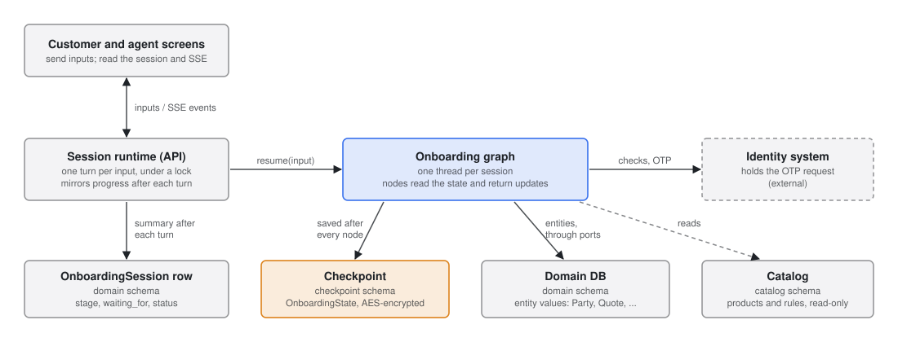
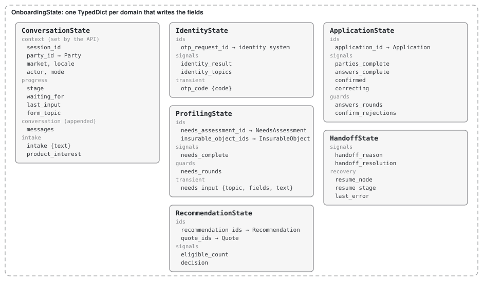
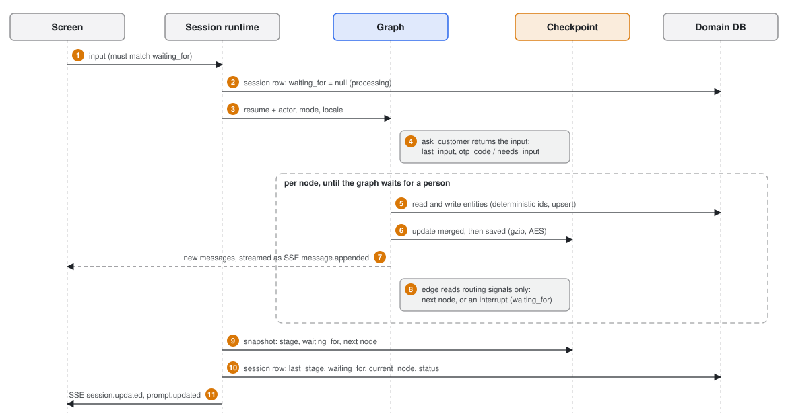
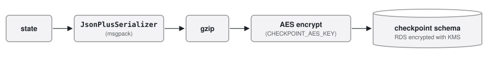

# State management

This is the state model for the onboarding graph: what the graph passes between nodes, what conditional
edges read, what is saved when the graph pauses, and how personal data is protected. How the graph itself runs
is in [langgraph-design.md](02-langgraph-design.md).

The model is described from the outside in, the way the C4 model zooms into a system:

| Level | Section | Shows |
|---|---|---|
| Stores | [§1](#1-where-session-data-lives) | The stores a session touches, what each one holds and who writes it |
| The state | [§2](#2-inside-the-graph-state) | What the graph state holds, grouped by the domain that writes it |
| One turn | [§3](#3-one-turn) | How one input moves through the state, the entities, the checkpoint and the session row |
| Reference | [§4](#4-state-schema) to [§8](#8-personal-data) | Schema and reducers, routing signals, checkpoint encryption, idempotent writes, personal data |

Three principles hold at every level:

1. **IDs in state, values in the database.** A node writes entity values to the domain schema and returns only
   the entity's ID to the state. Keeping one value in two places means they drift apart eventually.
2. **Everything a conditional edge reads is in the state.** Routing functions never query the database.
   Branching can be replayed from a checkpoint alone, and routing can be unit-tested without a database.
3. **Wait nodes pause with `interrupt()`.** A person's input resumes the same thread with
   `Command(resume=...)`. Session resume and agent handoff use this same mechanism.

## 1. Where session data lives



| Store | Holds | Lifetime | Written by |
|---|---|---|---|
| Graph checkpoint (`checkpoint` schema) | `OnboardingState` ([§2](#2-inside-the-graph-state)), compressed and AES-encrypted | One onboarding session. Meant to be deleted after 30 days without activity (cleanup job not built yet) | `AsyncPostgresSaver`, after every node |
| Domain DB (`domain` schema) | Customer and transaction entities: `Party`, `NeedsAssessment`, `InsurableObject`, `Recommendation`, `Quote`, `Application` | The customer relationship | Nodes, through the ports in `onboarding_core.ports`, and the API |
| Session row (`OnboardingSession`, `domain` schema) | A summary of the checkpoint: `last_stage`, `waiting_for`, `current_node`, `status`, plus `mode`, `locale` and the assigned agent | The session | The session runtime after every turn; assignment and language changes write it directly |
| Catalog (`catalog` schema) | `Product`, `EligibilityRule`, `TargetMarket` | While a product is on sale | The backend at startup (idempotent seed). The graph only reads it |

One thread is one onboarding session. When a session is created (`POST /api/sessions`) the backend creates an
empty `Party`, the `OnboardingSession` row, and the thread (`thread_id` = session ID), then runs the graph to its
first question. The customer and the agent open the same thread.

The session row exists so that the agent's session list reads these rows and never has to load and decrypt every
checkpoint. Only a single session's detail view reads its thread. The OTP request lives in the identity system; the state keeps
only its `otp_request_id`.

## 2. Inside the graph state



`OnboardingState` (`onboarding_agent/state.py` in `backend/packages/agent`) is composed of one `TypedDict` per
domain in `flows/` that writes the fields. It is still defined in this one module because it is the persisted
checkpoint schema: field names are channel names, so renaming one is a migration.

Every field is one of these kinds:

| Kind | What it is | Fields |
|---|---|---|
| Context | Set when the session is created, or by the API on every resume | `session_id`, `party_id`, `market`; `actor`, `mode`, `locale` |
| Progress | Where the conversation stands | `stage`, `waiting_for`, `last_input`, `form_topic` |
| Conversation | What was said, and the customer's first message | `messages`; `intake`, `product_interest` |
| Entity references | IDs of rows in the domain DB (or of the OTP request); the values stay there | `needs_assessment_id`, `insurable_object_ids`, `recommendation_ids`, `quote_ids`, `application_id`, `otp_request_id` |
| Routing signals | The result of the node before an edge, which the edge reads ([§5](#5-routing-signals)) | `identity_result`, `identity_topics`, `needs_complete`, `eligible_count`, `decision`, `parties_complete`, `answers_complete`, `confirmed`, `correcting`, `handoff_reason`, `handoff_resolution` |
| Loop guards | Counters that hand a loop that is not converging to a person | `needs_rounds`, `answers_rounds`, `confirm_rejections` |
| Transient inputs | An input held only until the node that reads it runs, then cleared | `otp_code` (read by `check_otp`), `needs_input` (read by `assess_needs`) |
| Recovery | What an ERROR handoff needs to go back to where it failed | `resume_node`, `resume_stage`, `last_error` |

Values that hold what the customer typed (`intake`, `otp_code`, `needs_input`) are dicts on purpose: the saver
stores plain strings and numbers inline, unencrypted, and only other values go through the encrypting serializer
([§6](#6-checkpointing)).

### What is not in the state

Extracted personal values (name, phone, ID number, date of birth), recommendation reasons and prices. They are
entity fields and live only in the domain DB. What the customer typed is in `messages`, which is why the
checkpoint is encrypted ([§6](#6-checkpointing)). The small forms the screens show are built when they are read,
from the state and the domain DB, so the checkpoint holds no pre-filled personal data either.

### State vs. entity fields with similar names

| State | Entity | Relation |
|---|---|---|
| `needs_complete` | `NeedsAssessment.missing_fields` | The entity holds the list; the state only knows whether it is empty |
| `answers_complete` | `Application.missing_fields` | Same |
| `identity_result` | `Party.verification_status`, `verification_method` | The entity holds the final result; the state holds the last attempt |
| `decision` | `Recommendation.status` | `await_decision` reads the input and updates the entity |
| `actor` | `captured_by`, `decided_by` | The state value is copied into the entity |
| `stage`, `waiting_for` | `OnboardingSession.last_stage`, `waiting_for` | The runtime copies them into the session row after every turn ([§3](#3-one-turn)) |

## 3. One turn

A turn starts with one input from a person and ends when the graph waits for the next one.



1. The screen sends an input. The runtime refuses it (`409`) while the previous turn is still running, or when it
   is not the input the session waits for (`waiting_for` on the session row).
2. Under the session's lock, the runtime clears `waiting_for` on the session row, so the screens show the session
   as processing.
3. The runtime resumes the thread with `Command(resume=input, update={actor, mode, locale})`. `mode` and `locale`
   come from the session row, so an agent's takeover or a language change applies from the next step on.
4. The pending wait node, `ask_customer`, receives the input. It records `last_input` and, for an OTP code or a
   needs answer, the transient `otp_code` or `needs_input`.
5. Each node reads the IDs it needs from the state and loads the entities through the ports. It writes new or
   changed entities with deterministic IDs ([§7](#7-idempotent-writes)) and returns an update: IDs, routing
   signals and new messages.
6. LangGraph merges the update into the state (`messages` is appended, every other field is overwritten,
   [§4](#field-groups-and-reducers)) and the checkpointer saves it, compressed and encrypted
   ([§6](#6-checkpointing)).
7. While the turn runs, new messages reach the screens as `message.appended` events.
8. The conditional edge after the node reads only routing signals and picks the next node. Steps 5 to 8 repeat
   until a wait node calls `interrupt()`, which ends the turn with a new `waiting_for`.
9. The runtime reads the thread's snapshot: `stage`, the pending interrupt's `waiting_for`, and the next node.
10. It copies them into the session row as `last_stage`, `waiting_for` and `current_node`, sets `status`
    (`ACTIVE`, `HANDOFF`, `SUBMITTED`, `DECLINED`, `WITHDRAWN`) and `last_activity_at`.
11. It publishes `session.updated` and `prompt.updated`. The prompt carries the form for the new wait.

If a node runs out of retries, the runner records `last_error` for that node and continues the graph into
`human_handoff`, so every turn still ends in a wait (see
[langgraph-design.md](02-langgraph-design.md#6-retries-and-error-handling)).

## 4. State schema

This is `onboarding_agent/state.py`, shortened. IDs are strings. `initial_state` sets every field when the
session is created.

```python
class ConversationState(TypedDict, total=False):
    messages: Annotated[list[AnyMessage], add_messages]
    actor: Literal["CUSTOMER", "AGENT"]
    mode: Literal["AUTO", "ASSIST"]
    session_id: str
    party_id: str
    market: Literal["KR", "US"]
    locale: Literal["ko", "en"]               # mirrors OnboardingSession.locale on every resume
    stage: Literal["IDENTITY", "PROFILING", "RECOMMENDATION", "APPLICATION",
                   "SUBMITTED", "HANDOFF", "DECLINED", "WITHDRAWN"]
    waiting_for: Literal["INTAKE", "IDENTITY_INFO", "OTP_CODE", "NEEDS", "DECISION",
                         "PARTIES", "ANSWERS", "CONFIRM", "AGENT"] | None
    last_input: ... | None                    # which input ask_customer just received
    form_topic: str | None                    # the small form the pending IDENTITY_INFO / NEEDS wait asks
    intake: dict[str, str] | None             # {"text"}: the first message; feeds the needs extraction
    product_interest: str | None              # a catalog product_type the intake points to

class IdentityState(TypedDict, total=False):
    identity_result: Literal["MATCHED", "NOT_MATCHED", "OTP_OK", "OTP_FAILED",
                             "DOC_OK", "DOC_FAILED"] | None
    otp_request_id: str | None
    otp_code: dict[str, str] | None           # {"code"}: set by ask_customer, cleared by check_otp
    identity_topics: list[str]                # identity forms answered ("contact", "id_document", "consent")

class ProfilingState(TypedDict, total=False):
    needs_assessment_id: str | None           # latest version
    insurable_object_ids: list[str]
    needs_complete: bool
    needs_rounds: int                         # loop guard, max 3: answers that filled nothing still missing
    needs_input: dict[str, Any] | None        # {"topic", "fields", "text"}: set by ask_customer, cleared by assess_needs

class RecommendationState(TypedDict, total=False):
    recommendation_ids: list[str]
    quote_ids: dict[str, str]                 # recommendation_id -> quote_id
    eligible_count: int
    decision: Literal["ACCEPT", "DECLINE", "CHANGE"] | None

class ApplicationState(TypedDict, total=False):
    application_id: str | None
    parties_complete: bool
    answers_complete: bool
    answers_rounds: int                       # loop guard, max 3
    confirmed: bool | None
    confirm_rejections: int                   # loop guard, max 3
    correcting: bool                          # a rejected summary came with a correction

class HandoffState(TypedDict, total=False):
    handoff_reason: Literal["IDENTITY_FAILED", "NO_ELIGIBLE_PRODUCT", "NEEDS_INCOMPLETE",
                            "ANSWERS_INCOMPLETE", "SUMMARY_REJECTED", "ERROR"] | None
    handoff_resolution: Literal["VERIFIED", "CONTINUE", "END"] | None
    resume_node: str | None                   # node to re-run after an ERROR handoff
    resume_stage: ... | None
    last_error: ErrorInfo | None              # node, kind, attempts

class OnboardingState(ConversationState, IdentityState, ProfilingState,
                      RecommendationState, ApplicationState, HandoffState, total=False): ...
```

### Field groups and reducers

| Group | Fields | Written by | Reducer |
|---|---|---|---|
| Conversation | `messages` | Every node and every human input | `add_messages`: append |
| Context | `session_id`, `party_id`, `market` | The API when the session is created | Overwrite (never changes) |
| Context | `actor`, `mode`, `locale` | The API when it resumes the graph (`Command(update=...)`) | Overwrite. `actor` is copied into `captured_by` and `decided_by` on entities |
| Progress | `stage`, `waiting_for`, `last_input`, `form_topic` | Nodes that change stage; nodes that ask; `ask_customer` | Overwrite |
| Intake | `intake`, `product_interest` | `ask_customer` on the first message; the node that reads the intake | Overwrite |
| Entity references | `*_id`, `*_ids` | The node that creates the entity | Overwrite. Lists are replaced whole |
| Routing signals and loop guards | `identity_result`, `needs_complete`, `needs_rounds`, `handoff_reason`, ... | The node just before the edge | Overwrite |
| Transient inputs | `otp_code`, `needs_input` | `ask_customer`; cleared by the node that reads them | Overwrite |
| Errors | `last_error` | The runner, when a node used up its retries | Overwrite |

Only `messages` needs a merging reducer. Everything else is overwritten, which keeps each field owned by the
node that last decided it.

## 5. Routing signals

A routing signal is the **result** of the previous node. Failed identity attempts are counted in
`Party.verification_attempts` in the database. The state keeps only the latest result, and the graph's shape
decides what follows each result. The only counters in the state are the loop guards (`needs_rounds`,
`answers_rounds`, `confirm_rejections`). The full edge table is in
[langgraph-design.md](02-langgraph-design.md#conditional-edges).

## 6. Checkpointing

The checkpointer is `AsyncPostgresSaver` from `langgraph-checkpoint-postgres` 3.1.2, on a connection pool whose
connections use `search_path=checkpoint`. `saver.setup()` creates its tables at startup. State is saved after
every node.

**Encryption: compress, then AES.** `messages` holds what the customer typed. Storage encryption (RDS with KMS)
alone lets anyone who can read the table see plain text. So the checkpoint content is encrypted in the
application too:



- The serializer passed to the saver (`serde=`) is
  `EncryptedSerializer.from_pycryptodome_aes(serde=GzipSerde(JsonPlusSerializer()))`. It compresses first and
  encrypts second: ciphertext does not compress, so the order matters.
- Stored blobs are typed like `gz_msgpack+aes`. `EncryptedSerializer` splits the type on the first `+`, so the
  gzip layer marks itself with a `gz_` prefix instead of adding another `+`.
- The saver stores primitive channel values (strings, numbers, booleans such as `stage` or `needs_complete`)
  inline in the plain JSONB of `checkpoint.checkpoints`. Only other values go through the serializer. That is why
  the OTP code is wrapped as `{"code": ...}`: it then lands in an encrypted blob.
- A test (`backend/tests/test_checkpoint_encryption.py`) runs seed customer B to the recommendation and reads the
  raw rows of `checkpoints`, `checkpoint_blobs` and `checkpoint_writes`. The phone number, email, name, ID number,
  OTP code and needs text never appear; every blob type ends in `+aes`. The graph still reads its own state back.
- The key is a 256-bit AES key (`CHECKPOINT_AES_KEY`, 64 hex chars). In AWS, Terraform generates it, stores it in
  Secrets Manager (encrypted with the project KMS key), and ECS injects it into the backend task only.
- `PostgresSaver` accepts the serializer as a constructor argument. That was the reason for choosing it over
  the DynamoDB saver. See [tradeoffs.md](../decisions/tradeoffs.md#3-checkpoint-store-dynamodb-vs-postgresql).
- The key is not rotated. Reading with a different key fails. Rotation is in
  [future-improvements.md](../decisions/future-improvements.md).

**Retention.** Checkpoints are meant to be deleted after 30 days without activity: that is both the window in
which a customer can resume and the window in which the conversation's personal data is kept. The daily cleanup
job is designed but not built (see [future-improvements.md](../decisions/future-improvements.md)). Domain entities outlive the
checkpoint, so a session's outcome (submission, decline, withdrawal) stays visible after its conversation is gone.

## 7. Idempotent writes

The checkpoint and the entities share one PostgreSQL instance, but they are **not** written in one
transaction: LangGraph saves the checkpoint on its own connection after the node returns. If a node writes
entities and the process dies before the checkpoint is saved, the node runs again on resume. Every node write
must therefore be safe to repeat.

| Technique | How |
|---|---|
| Deterministic entity IDs | New IDs are `uuid5(namespace, "thread_id:node:langgraph_step:extra")` (`onboarding_agent/ids.py` `node_uuid`). A re-run of the same node at the same step produces the same ID, and rows are written with the repositories' `save` (SQLAlchemy `merge`, an upsert). Partner purchases use the order ID as `extra`, so fetching them twice gives the same object |
| Idempotency key on external calls | `submit_application` skips the call if the application already has a `submission_ref`, and sends `Idempotency-Key: <application_id>`. The contract admin system returns the first response again (`200` with the same `submission_ref`), so an application is never received twice |
| Retries per node | `RetryPolicy` with exponential backoff on LLM and external-call nodes. When retries run out, `last_error` is set and the graph goes to `human_handoff` |

## 8. Personal data

| Data | Handling |
|---|---|
| Name, email, phone, date of birth | Stored in `Party` in the domain schema. Not copied into the state |
| ID document number | Never stored in plain text. An HMAC (`id_document_hmac`, keyed with `SESSION_HMAC_KEY`) for matching, and an AES-EAX encrypted copy (`id_document_number_enc`, keyed with `CHECKPOINT_AES_KEY`) because `check_document` must send the number to the identity system. The agent API never returns it |
| Conversation text | In `messages` inside the checkpoint: compressed and AES-encrypted, on KMS-encrypted storage |
| OTP code | Held only between `ask_customer` and `check_otp`, inside an encrypted checkpoint blob, then cleared. `otp_request_id` stays in the state |
| Session link token | Only its HMAC (`token_hmac`, `SESSION_HMAC_KEY`) is stored. One token reaches one thread |
| Logs | Message bodies are not logged. A failed run logs the session ID and the exception type |
| SSE events | `session.updated` carries the session summary; its display name is the customer's name only after verification (`Unverified #xxxx` before). `message.appended` carries the message text, so it holds whatever the customer typed. `entity.updated` carries only the entity type and ID; the screen reads details through the API |
| Partner lookup | Only after consent. The consent time is recorded in `Party.third_party_consent_at` and sent as `X-Consent-At`; the partner (and the mock) returns `403` without it |
| Contract submission | ID number and contact details are not sent. The payload holds the product, quote, parties (name, date of birth, role), the insured object, answers and summary |
