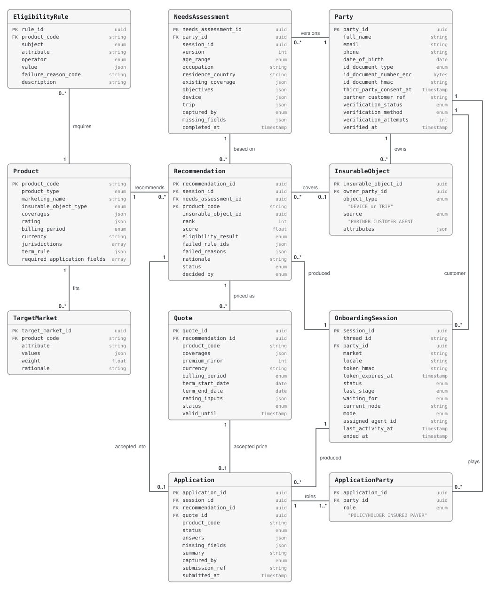

# Data model

Domain entities in the `domain` and `catalog` schemas. Names follow ACORD where one exists (`Party`,
`InsurableObject`, `Quote`, `Policy`) and IDD for suitability (`NeedsAssessment`, `TargetMarket`). Graph state is
separate and described in [state-management.md](03-state-management.md).

This page matches `backend/app/db/models.py`, which maps the entity dataclasses of `onboarding-core`
(`backend/packages/core`) onto these tables. The backend runs its Alembic migrations
(`backend/app/db/migrations/`) to head at startup and then upserts the catalog seed. Both steps are idempotent
and run under a Postgres advisory lock, so several starting replicas do not race. `0001` is the schema as
`create_all` built it before migrations existed; a database from that time has the tables but no
`alembic_version`, so it is stamped at `0001` instead of running it. A test checks that the models and the
migrated schema do not drift. New migrations come from `uv run alembic revision --autogenerate -m "..."` in
`backend/`.

## 1. Entity groups

Entities are grouped by lifetime and by who changes them.

| Group | Entities | Changed by | Lifetime | Personal data |
|---|---|---|---|---|
| Reference (`catalog`) | `Product`, `EligibilityRule`, `TargetMarket` | Seed data, upserted at backend startup | While a product is on sale | None |
| Customer | `Party`, `NeedsAssessment`, `InsurableObject` | The workflow | The customer relationship | Yes |
| Transaction | `OnboardingSession`, `Recommendation`, `Quote`, `Application`, `ApplicationParty` | The workflow | Each onboarding. Outlives the conversation checkpoint | Yes (`answers`) |
| Result | `Policy` | Contract admin system | The contract term | Out of scope, no table |

## 2. Relationships

Enum columns are stored as short strings; the allowed values are enforced by the code, not by the database.

## 3. Key rules

| Entity | Rule |
|---|---|
| `Party` | Created empty when the session is created, filled in the identity stage. Status goes `UNVERIFIED` → `PENDING` → `VERIFIED` (method `PARTNER_MATCH`, `OTP`, `DOCUMENT` or `AGENT`) or `FAILED`. Other insured persons and payers are created in the application stage and are not verified. The ID number is stored only as an HMAC plus an AES-encrypted copy |
| `NeedsAssessment` | While the questions for one pass are still open, the same version is updated with each answer. Once complete (`completed_at` set) it is never edited. A `CHANGE` creates the next `version`, and recommendations based on older versions expire |
| `InsurableObject` | Kept separate from the application: eligibility runs before the application exists, it can come from the partner, and one customer can have several. A device the customer describes is assumed new, undamaged and bought today unless they say otherwise; those defaults are listed in `attributes.assumed_fields` and never copied into application answers. A traveller is a `Party`, not an attribute of the trip |
| `EligibilityRule` | Evaluated by code: `subject.attribute operator value` (operators `EQ`, `IN`, `GTE`, `LTE`, `WITHIN_DAYS`; subjects `PARTY`, `NEEDS_ASSESSMENT`, `INSURABLE_OBJECT`, `DERIVED`). A missing value fails the rule. Failures are recorded on the recommendation as rule IDs and `failure_reason_code: description` |
| `TargetMarket` | Never excludes; only adds `weight` to the rank score. Its `rationale` is the only ground the LLM gets for explaining a recommendation |
| `Recommendation` | One row per product of the session's market per run, **including ineligible ones**. Eligible products rank first by score. Accepting one moves the flow to the application stage |
| `Quote` | One per eligible recommendation. Price computed from `Product.rating` (`TIERED`, `PERCENT`, `PER_TRIP_DAY`, `FLAT`) and object values; `rating_inputs` records how. `valid_until` is `min(created_at + 24h, term start 00:00 UTC)` when the term starts in the future, otherwise `created_at + 24h`. An accepted quote that has expired is re-priced when the application is opened |
| `Application` | Opened as `DRAFT` with answers pre-filled from the insured object and verified data. Missing fields = `Product.required_application_fields` without a value. `INCOMPLETE` while any are missing, `COMPLETE` when none are, `SUBMITTED` with the `submission_ref` from the contract admin system |
| `ApplicationParty` | One row per role: `POLICYHOLDER` is the customer; `INSURED` and `PAYER` default to the customer unless someone else was named |
| `OnboardingSession` | One per graph thread. Holds the session link HMAC, the market, the language (`locale`, `ko` or `en`: defaults to the market's, the customer or an agent can change it), and a progress summary so the agent list does not read checkpoints. `token_expires_at` (48 hours) is stored but not checked yet |

## 4. State transitions

| Moment | `Party.verification_status` | `NeedsAssessment` | `Recommendation.status` | `Quote.status` | `Application.status` |
|---|---|---|---|---|---|
| Session start | `UNVERIFIED` | — | — | — | — |
| Identity details given | `PENDING` | — | — | — | — |
| Identity done | `VERIFIED` (or `FAILED` → agent) | — | — | — | — |
| Profiling | `VERIFIED` | v1, fields missing | — | — | — |
| Recommendations shown | `VERIFIED` | v1 complete | `PROPOSED` × products in the market | `ISSUED` × eligible | — |
| Customer changes answers | `VERIFIED` | v2 | v1 rows `EXPIRED`, v2 rows `PROPOSED` | v1 rows `EXPIRED`, new `ISSUED` | — |
| Customer declines | `VERIFIED` | v1 or v2 | eligible rows `DECLINED` | unchanged | — |
| Recommendation accepted | `VERIFIED` | v2 | one `ACCEPTED` | that one `ACCEPTED` | `DRAFT` |
| Filling gaps | `VERIFIED` | v2 | `ACCEPTED` | `ACCEPTED` | `INCOMPLETE` |
| Waiting for confirmation | `VERIFIED` | v2 | `ACCEPTED` | `ACCEPTED` | `COMPLETE` |
| Submitted | `VERIFIED` | v2 | `ACCEPTED` | `ACCEPTED` | `SUBMITTED` |

## 5. Product catalog seed

Eight products: two markets × the four product types from the brief (`onboarding_core/catalog/seed.py` in `backend/packages/core`).
Values are modelled on public products and are not bolttech's real rates.

| Code | Type | Pricing | Billing | Term |
|---|---|---|---|---|
| `KR-MOB-SWAP` | Mobile | MSRP tiers, ₩5,990–15,990 | Monthly | 36 months from the quote date |
| `KR-DEV-LAPTOP` | Device | MSRP tiers, ₩7,200–8,400 | Monthly | 36 months from the quote date |
| `KR-EW-HOME` | Extended warranty | Purchase price tiers, ₩4,000–70,000 | One-time | 4 years after the manufacturer warranty |
| `KR-TRV-OVERSEAS` | Travel | ₩1,350 per day, min ₩1,850 | Per trip | Departure to return |
| `US-MOB-BOLT` | Mobile | MSRP tiers, $7.99–13.99 | Monthly | 1 month, auto-renew flag |
| `US-DEV-LAPTOP-2Y` | Device | Purchase price tiers, $20–180 | One-time | 24 months from the quote date |
| `US-EW-TV-3Y` | Extended warranty | Purchase price tiers, $50–150 | One-time | 3 years from the quote date |
| `US-TRV-SINGLE` | Travel | 6% of trip cost, min $50 | Per trip | Departure to return |

Notes on the rules as implemented:

- Terms marked `PURCHASE_DATE` in the seed start on the day the policy is bought, which is the quote date.
- MSRP-tier products fall back to the purchase price when no list price is known (for example a partner purchase
  record). `rating_inputs.basis_fallback` records this.
- When the manufacturer warranty end is unknown, it is assumed to be one year after purchase.
- Trip length counts both days: 3 to 7 October is 5 days.

A session only evaluates the products whose `jurisdictions` include its market. All products except
`KR-EW-HOME` also have a residence rule, plus product-specific rules (device category, days since purchase or
activation, condition, trip length, and so on).
