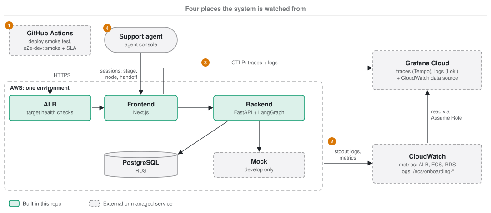

# Observability

This page goes from the outside in, the way the C4 model zooms into a system: first where the system is watched
from, then what each deployed part sends, then the traces and logs inside the application.

| Level | Section | Answers |
|---|---|---|
| Watch points | [§1](#1-where-the-system-is-watched) | Is it up, is it fast, is it healthy, and is each session moving? |
| Parts | [§2](#2-what-each-part-sends) | Which container, load balancer or database reports what, and where it lands |
| Inside the application | [§3](#3-traces-and-logs-in-the-application) | How one request becomes a trace, and what a log line carries |

How to keep the volume down, turn export on and read CloudWatch from Grafana is in [§4](#4-keeping-it-small)
to [§6](#6-cloudwatch-in-grafana).

## 1. Where the system is watched



| # | Watch point | Question | Where to look |
|---|---|---|---|
| 1 | **Probes from outside** | Does each host answer, and does it load fast enough? | GitHub Actions: `deploy-develop`'s smoke test (`/healthz` through the frontend to the backend) after every deploy, and `e2e-dev` (read-only smoke checks and the page-load SLA) after every successful develop deploy and daily at 09:00 KST |
| 2 | **Platform** | Are the tasks, the load balancer and the database healthy? | CloudWatch: Container Insights for ECS, ALB and RDS metrics, and every container's stdout in `/ecs/onboarding-<env>-{backend,frontend,mock}` (kept 30 days). The ALB drops a frontend task that fails `/api/healthz` |
| 3 | **Application** | What did one request do, and why did it fail? | Grafana Cloud: traces (Tempo) and structured logs (Loki) from the backend and the frontend over OTLP. The same stack reads CloudWatch ([§6](#6-cloudwatch-in-grafana)) |
| 4 | **Workflow** | Where is each onboarding session, and which ones need a person? | The agent console: every session's stage, status, what it waits for, its current node and the conversation, updated over SSE. Sessions in `HANDOFF` go to the top of the list. See [langgraph-design.md](02-langgraph-design.md#human-handoff) |

The first three are for whoever runs the system. The fourth is for support agents, and is also where a stuck
session shows first: a node that runs out of retries hands the session to an agent with its error, so the
agent sees the failed node before anyone opens a trace.

No alarms or dashboards are defined in code yet: the signals are there, but nothing pages anyone.

## 2. What each part sends

| Part | Traces | Logs | Metrics | Health |
|---|---|---|---|---|
| ALB | — | — | CloudWatch (`AWS/ApplicationELB`) | Target health: frontend `/api/healthz`, docs `/` |
| Frontend (Next.js) | OTLP: one span per route and render, and each `fetch` to the backend | OTLP and stdout: `lib/server/log.ts` and Next's unhandled request errors (`onRequestError`) | Container Insights | `/api/healthz` (the frontend alone); `/healthz` relays to the backend |
| Backend (FastAPI) | OTLP: one span per request, httpx calls to partner, identity and contract admin, botocore calls to Bedrock | OTLP and stdout: every record at `LOG_LEVEL` (default INFO) and above from the app; library loggers at WARNING | Container Insights | `/healthz` |
| Mock | — | stdout | Container Insights | — |
| PostgreSQL (RDS) | — | — | CloudWatch (`AWS/RDS`) | — |

Telemetry is set up in `backend/app/telemetry.py` and `frontend/instrumentation.ts`. Each service names itself
with `OTEL_SERVICE_NAME` (`onboarding-backend`, `onboarding-frontend`) and tags everything with
`deployment.environment`, so one Grafana stack can hold develop and prod apart.

Logs go both ways on purpose: stdout reaches CloudWatch even when OTLP export is off or failing.

## 3. Traces and logs in the application

The frontend passes `traceparent` to the backend, so a relayed call and the API call it causes are one trace.
Logs written inside a span carry its trace and span ids (in the OTLP record, and as `trace_id`/`span_id` in the stdout JSON).

To follow one request, open its trace. To follow one onboarding session across requests and graph runs, filter
the logs by `session_id`.

### Log format

Logs are structured. On stdout every line is one JSON object; over OTLP the same fields arrive as log attributes
(in Loki, structured metadata), so they can be filtered and grouped without parsing the message.

```json
{"ts": "2026-09-21T13:33:54.304+00:00", "level": "INFO", "logger": "app.services.runtime", "msg": "turn finished",
 "trace_id": "71957a97…", "span_id": "3d52439a…", "session_id": "b235ccb9-…", "stage": "IDENTITY",
 "status": "ACTIVE", "waiting_for": "IDENTITY_INFO", "mode": "AUTO"}
```

| Field | Meaning |
|---|---|
| `ts`, `level`, `logger`, `msg` | Always present. `msg` is a fixed string (`turn finished`, `graph run failed`); the context goes in fields |
| `trace_id`, `span_id` | When logged inside a request, the trace it belongs to |
| `session_id`, `stage`, `status`, `waiting_for`, `mode`, `market` | Onboarding context, on the events below |
| `http.request.method`, `url.path`, `http.response.status_code`, `client.address` | Access log lines (uvicorn), split out of the line |
| `exception.type`, `exception.message`, `exception.stacktrace` | When an error is logged. The stack is not in `msg` |

Backend events: `session created`, `turn finished` (once per graph run, with the stage it reached),
`graph run failed` and `could not route the failure to human_handoff` (logger `onboarding_agent.runner`), and the SSE broker's `could not publish event`
and `LISTEN connection lost; reconnecting`. Frontend events: `backend relay failed` and `request failed` (Next's
unhandled errors). In code, pass context with `extra=` (Python) or the `fields` argument (`lib/server/log.ts`),
never by formatting it into the message.

## 4. Keeping it small

| Control | Where | Effect |
|---|---|---|
| `LOG_MAX_CHARS` (default 2000) | Both services | The message and every string field are cut to this many characters from the head; `exception.stacktrace` is cut from the tail, where the error is. The cut is marked `…[+N chars]`. The same cap applies to span attribute values |
| Quiet paths | Both services | `/healthz` and the SSE `/stream` endpoints produce no spans. A stream is one long connection, so its span would say nothing per event. Health-check access logs are dropped |
| Sub-spans | Backend | The ASGI `receive`/`send` spans are not recorded |
| Library loggers | Backend | `httpx`, `botocore`, `psycopg`, `langchain`, `langgraph` and similar log at WARNING only |

Traces are not sampled: after the quiet paths are removed, a demo's traffic is small. `OTEL_TRACES_SAMPLER` can
change that without code.

## 5. Turning it on

Terraform leaves export off until `otlp_endpoint` is set in the environment's `terraform.tfvars`.

1. In Grafana Cloud, open the stack, then **Connections → OpenTelemetry (OTLP)**. Generate a token there. The page
   shows the endpoint (`https://otlp-gateway-<region>.grafana.net/otlp`) and a ready-made
   `OTEL_EXPORTER_OTLP_HEADERS` value (`Authorization=Basic <base64(instance_id:token)>`).
2. Set `otlp_endpoint` in `infra/envs/<env>/terraform.tfvars` and apply. This creates the secret
   `onboarding-<env>/otlp-headers` with a placeholder and wires both services to it.
3. Put the real header into the secret yourself (the token never goes into Terraform, git or chat), then restart
   the tasks so ECS injects it:

   ```bash
   aws secretsmanager put-secret-value --secret-id onboarding-develop/otlp-headers \
     --secret-string 'Authorization=Basic <value from step 1>'
   aws ecs update-service --cluster onboarding-develop --service onboarding-develop-backend --force-new-deployment
   aws ecs update-service --cluster onboarding-develop --service onboarding-develop-frontend --force-new-deployment
   ```

Locally, export stays off unless `OTEL_EXPORTER_OTLP_ENDPOINT` is set in the environment.

## 6. CloudWatch in Grafana

The same stack can read CloudWatch metrics (ALB, ECS, RDS) and the log groups through the CloudWatch data source,
using **Grafana Assume Role**. `infra/envs/develop/grafana.tf` creates a read-only role for it once
`grafana_aws_account_id` and `grafana_external_id` are set. Both values are shown on the data source's Settings tab.
The role can read metrics and list log groups, but can query only the `/ecs/onboarding-*` log groups.
