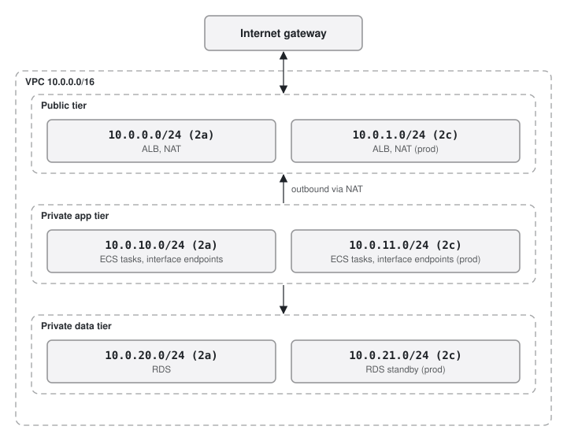
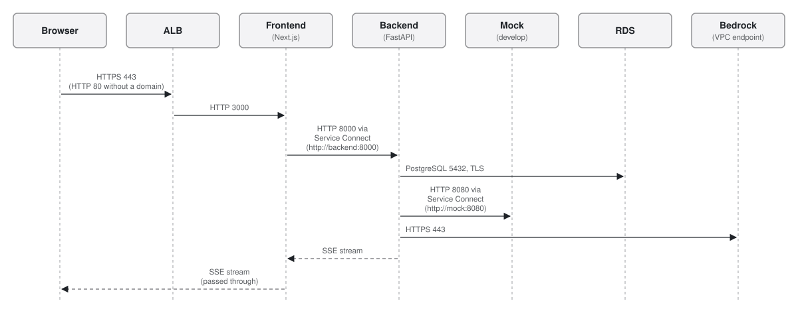
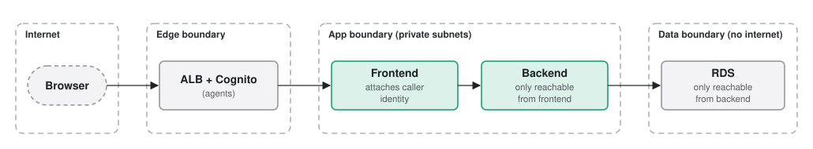

# Networking design

Network topology, how traffic flows between the browser and each service, the security boundaries, and
authentication.

## 1. Topology

One VPC in ap-northeast-2, two availability zones (2a and 2c), three subnet tiers per zone.

| Tier | CIDR (2a, 2c) | Contains | Internet |
|---|---|---|---|
| Public | `10.0.0.0/24`, `10.0.1.0/24` | ALB, NAT gateway | In and out |
| Private app | `10.0.10.0/24`, `10.0.11.0/24` | ECS tasks: frontend, backend, mock | Outbound only, through NAT |
| Private data | `10.0.20.0/24`, `10.0.21.0/24` | RDS subnet group | None |

### VPC endpoints

AWS services are reached through VPC endpoints, not through NAT.

| Endpoint | Type | Used by |
|---|---|---|
| `s3` | Gateway (free) | ECR image layers |
| `bedrock-runtime` | Interface | Backend LLM calls |
| `secretsmanager` | Interface | Backend secrets, injected by ECS when a task starts |
| `ecr.api`, `ecr.dkr` | Interface | Image pulls |
| `logs` | Interface | CloudWatch Logs |

A Bedrock request carries customer conversation, so it never goes over the internet.

**Develop puts interface endpoints in one AZ only (2a).** Interface endpoints are billed per hour per AZ and
are the biggest item in the develop bill. Develop tasks in 2c cross to the 2a endpoints. Prod places them in both
AZs.

### NAT

NAT is only for calls from tasks to the public internet: in prod, the real partner, identity and contract admin
systems once they exist, and later the frontend fetching the ALB's public keys to verify the signed agent header.
The `nat_public_ips` output lists the egress IPs for allow-listing at those systems. The Cognito login pages are
reached by the browser, not by the tasks. Develop has one NAT gateway; prod has one per AZ.

## 2. Traffic flows

| Segment | Protocol | Port |
|---|---|---|
| Browser → ALB | With a domain (develop): HTTPS, and HTTP redirects to HTTPS. Without one (prod today): HTTP | 443 / 80 |
| ALB → Frontend | HTTP, target group | 3000 |
| Frontend → Backend | HTTP over ECS Service Connect, `http://backend:8000` | 8000 |
| Backend → Mock (develop) | HTTP over ECS Service Connect, `http://mock:8080` | 8080 |
| Backend → RDS | PostgreSQL, TLS required | 5432 |
| Backend → Bedrock, Secrets Manager | Interface endpoints | 443 |

### Frontend-to-backend: the frontend relays

The browser can only reach the ALB and the frontend. It never calls the backend. The frontend's route handlers
under `/api/*` forward each request to `BACKEND_URL`:

- The backend is never exposed to the internet and accepts traffic only from the frontend's security group.
- The frontend attaches the caller's identity: `X-Agent-Id` for agents, `X-Session-Token` (from the session
  cookie) for customers. The backend checks the session token against its stored HMAC and trusts `X-Agent-Id`.
- Chat updates are **server-sent events**. The backend streams them; the frontend passes the stream through
  unchanged. The ALB idle timeout is raised from 60 s to **300 s**, and the backend sends a `: ping` comment every
  15 s so idle streams stay open.
- Health checks: the ALB target group checks the frontend at `/`, so a backend outage does not cycle frontend
  tasks. The container images have their own health checks (frontend `/api/healthz`, backend `/healthz`). The
  deploy smoke test calls `<base_url>/healthz`, which the frontend relays to the backend.

Locally the same relay runs in Docker Compose: `frontend` calls `http://backend:8000` on the Compose network.

### Service-to-service: ECS Service Connect

Each ECS service registers a short name in a Service Connect namespace (`backend`, `mock`). Callers use
`http://backend:8000` and `http://mock:8080`, which are the same names as in Docker Compose, so configuration
does not change between local and AWS. Traffic inside the VPC is plain HTTP; see
[tradeoffs.md](../decisions/tradeoffs.md).

## 3. Security groups

Each group admits traffic only from the group in front of it.

| Security group | Inbound | Attached to |
|---|---|---|
| `sg-alb` | 443 and 80 from `0.0.0.0/0` | ALB |
| `sg-frontend` | 3000 from `sg-alb` | Frontend tasks |
| `sg-backend` | 8000 from `sg-frontend` | Backend tasks |
| `sg-mock` | 8080 from `sg-backend` | Mock tasks (develop) |
| `sg-docs` | 8080 from `sg-alb` | Docs site tasks (static, nginx) |
| `sg-rds` | 5432 from `sg-backend` | RDS |
| `sg-endpoints` | 443 from `sg-frontend`, `sg-backend`, `sg-mock`, `sg-docs` | Interface endpoints |

Only the backend reaches the database. The frontend does not know about the database, the mock or Bedrock.
Task egress is open (to reach the endpoints and NAT); ingress is what limits each hop.

## 4. Security boundaries

| Boundary | What protects it |
|---|---|
| Internet → edge | Only the ALB is public. With a domain: HTTPS only, and `/agent`, `/agent/*`, `/api/agent/*` require a Cognito login at the ALB |
| Edge → app | Tasks are in private subnets with no public IPs. The frontend only accepts traffic from the ALB |
| Frontend → backend | Backend only accepts traffic from the frontend's security group. The frontend relays agent calls only with an agent identity and customer calls only with a session cookie; the backend rejects unknown session tokens |
| App → data | RDS is in subnets with no route to the internet and only accepts the backend. TLS required. KMS encryption at rest |
| Checkpoint contents | Compressed and AES-encrypted by the backend. Only the backend role can read the key |
| App → AWS APIs | VPC endpoints; each task role allows only what that service needs |

## 5. Authentication

### Agents: Cognito through the ALB

1. Each environment has three hosts: customers use the app host (develop `dev.app.`, prod `app.onboardassist.click`),
   agents the agent host (`dev.agent.` / `agent.`), and the docs have their own (`dev.docs.` / `docs.`). Every path
   on the agent host goes through an `authenticate-cognito` rule, and the frontend serves the console at its root;
   the console's own API calls are covered by the same ALB session cookie (8 hours). On the app host, `/api/agent/*`
   answers 404 at the ALB, so no agent data is reachable without the login, and the frontend redirects `/agent`
   and `/agent/*` to the same page on the agent host (in `proxy.ts`, since an ALB redirect writes `:443` into the URL).
   Without an agent host (`agent_domain_name` empty) the console stays on the app host behind the same rule on
   those paths. Requests for the docs host (`dev.docs.` / `docs.`) go to the docs site through a plain forward
   rule on the host header, with no login: the design docs are public.
2. The Cognito user pool accepts only accounts an admin creates (email as username, optional TOTP MFA).
3. After login, the ALB adds `x-amzn-oidc-identity` (the user's `sub`) and a signed JWT, `x-amzn-oidc-data`, to
   each request it forwards.
4. The frontend resolves the agent ID in `lib/server/agentAuth.ts` and relays to the backend with
   `X-Agent-Id: <agent id>`. The backend treats the caller as `actor = AGENT`.

What is built today:

| `AGENT_DEV_AUTH` | Agent ID used | Where |
|---|---|---|
| `true` | Always `agent-demo` | Local, and develop (the Terraform default) |
| `false` | The ALB's `x-amzn-oidc-identity` header; `401` without it | Not used yet |

Verifying the signature of `x-amzn-oidc-data` (ES256, with the ALB public key for the region) is a `TODO` in
`agentAuth.ts`. Until it is done, `AGENT_DEV_AUTH` stays `true`: in develop, Cognito at the ALB decides who may
open the console, but every signed-in agent acts as `agent-demo`. Prod has no domain yet, so it has neither
HTTPS nor Cognito. See [future-improvements.md](../decisions/future-improvements.md).

### Customers: the landing page or a session link

Customers have no account. They start in one of two ways.

**On their own, from the landing page** (the app host's root):

1. The customer clicks start (or types a first message) on `/`. The browser calls the frontend's public
   `POST /api/start {market, locale}`, which relays to the backend's `POST /api/public/sessions` with
   `X-Client-IP`: the **last** `X-Forwarded-For` entry, the address the ALB accepted the connection from. Earlier
   entries are whatever the client sent and are ignored, so a client cannot choose its own bucket.
2. The backend allows 5 new sessions per client address and 200 in total per hour (`SELF_SERVE_PER_IP_PER_HOUR`,
   `SELF_SERVE_PER_HOUR`), counted in Postgres under an advisory lock so replicas share the limit and two requests
   cannot both take the last slot. Over a limit it answers `429` with `retry_after`, and the landing page says
   when to try again. It stores an HMAC of the address (`client_ip_hash`), never the address, and marks the
   session `origin = SELF_SERVE`.
3. The frontend puts the returned token straight into the `onb_session` cookie (the same cookie as below) and
   returns only the session ID, so the token never reaches browser code. The browser goes to `/chat`.
4. A returning visitor whose cookie still points to a session that has not ended is offered to continue it or
   start a new one.

**From a link an agent created:**

1. An agent clicks **New session** in the console. The browser calls `POST /api/agent/sessions {market}`, which
   sits behind the ALB's Cognito rule, and the frontend relays it to the backend's `POST /api/sessions` with the
   agent identity. The backend creates the session and a random token (`secrets.token_urlsafe(32)`) and returns
   `customer_path: /s/{token}`, which the console shows on the customer host (`CUSTOMER_BASE_URL`). The session is
   marked `origin = AGENT_LINK`; the console shows each session's origin.
2. The backend stores only the token's HMAC (`token_hmac`, keyed with `SESSION_HMAC_KEY`), never the token
   itself. It also stores `token_expires_at` (48 hours), but does not check it yet.
3. The customer opens `/s/{token}`. `proxy.ts` (Next.js 16's middleware) stores the token in an httpOnly cookie,
   `onb_session` (`SameSite=Lax`, 24 hours, `Secure` when `COOKIE_SECURE=true`), and sets
   `Referrer-Policy: no-referrer` so the link does not leak through the referrer. It does not validate the token.
4. The `/api/customer/*` route handlers read the cookie and send it as `X-Session-Token`. The backend looks up
   the session by the token's HMAC and answers `401` if there is none.
5. One token reaches exactly one thread. Who the customer actually is gets decided by the graph's identity stage,
   not by the link.

A browser holds one customer cookie. Opening a second session link in the same browser replaces the first
session's cookie.
