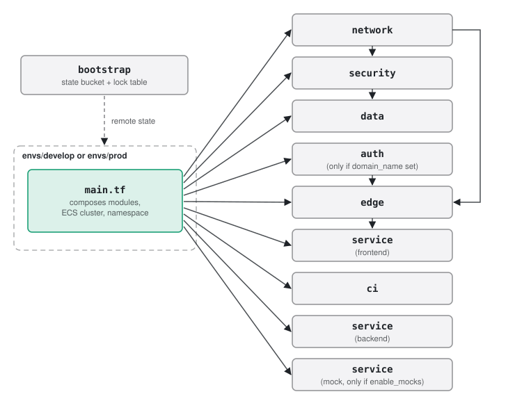

# Terraform structure

All AWS resources are defined in `infra/`. Reusable modules hold the resources; each environment is a thin
composition of those modules with its own variables and its own state. Terraform >= 1.5 (CI and deploys pin
1.5.7) with the AWS provider `>= 5.70, < 7.0`.

## 1. Layout

```
infra/
  bootstrap/    one-time: S3 state bucket + DynamoDB lock table (local state, applied once by the owner)
  modules/
    network/    VPC, subnets, route tables, NAT, S3 gateway endpoint, interface endpoints (AZs are a variable)
    security/   security groups and their rules, KMS key
    data/       RDS PostgreSQL 16, parameter group (TLS forced), application secrets
    auth/       Cognito user pool, domain, app client for the ALB
    edge/       ALB, target group, listeners, ACM certificate + Route 53 records, Cognito rule on the agent host
    service/    one ECS service: task definition, Service Connect, task + execution roles, log group
    ci/         GitHub OIDC provider and ECR repositories (shared), one deploy role per environment
  envs/
    develop/    main.tf composes the modules + ECS cluster and Service Connect namespace; terraform.tfvars
    prod/       identical main.tf; different terraform.tfvars and state key
```



## 2. Modules

| Module | Main resources | Key inputs | Key outputs |
|---|---|---|---|
| `network` | VPC `10.0.0.0/16`, 3 subnet tiers × 2 AZs, NAT (one or one per AZ), S3 gateway endpoint, interface endpoints for `bedrock-runtime`, `secretsmanager`, `ecr.api`, `ecr.dkr`, `logs` | AZs, single NAT flag, AZs for interface endpoints | VPC and subnet IDs, endpoint SG, NAT IPs |
| `security` | ALB, frontend, backend, mock and RDS security groups and the rules between them; endpoint SG rules; KMS key | VPC ID, `enable_mocks` | SG IDs, KMS key ARN |
| `data` | RDS instance, subnet group, parameter group (`rds.force_ssl`), RDS-managed master secret, generated checkpoint AES key and session HMAC key in Secrets Manager | Instance class, Multi-AZ, deletion protection, KMS key | Address, DB name/user, secret ARNs |
| `auth` | Cognito user pool (admin-created users, optional TOTP MFA), hosted UI domain, app clients for the ALB (agent and operator hosts), the `operators` group, predefined accounts with their passwords in Secrets Manager | Domains, `accounts` | Pool ARN, client IDs, pool domain, accounts secret name |
| `edge` | ALB (idle timeout 300 s), frontend target group (health check `/api/healthz`), docs target group (`/`) and, with a docs host, its public host-header rule, HTTP listener, and with a domain: ACM certificate validated in Route 53, alias records for the app and docs hosts, HTTPS listener, Cognito rule on `/agent`, `/agent/*`, `/api/agent/*` | Domain, Route 53 zone, subnets, SG, Cognito settings | Target group ARN, DNS name, `base_url` |
| `service` | ECS service (circuit breaker with rollback), task definition, Service Connect (server or client only), task and execution roles, log group (30 days) | Image, port, CPU/memory, env vars, secrets, desired count, SG, optional target group | Service name |
| `ci` | GitHub OIDC provider and ECR repositories (created or looked up), deploy role trusted for the listed OIDC subjects | Repository, OIDC subjects, `create_shared_resources`, state bucket and lock table | Deploy role ARN, ECR URLs |

The `service` module is used four times: frontend, backend, docs and mock. The mock instance is created only when
`enable_mocks = true`.

HTTPS and Cognito depend on a domain. The certificate, HTTPS listener, alias record and Cognito rule are
created only when `domain_name` is set, and the `auth` module only exists then. Without a domain the ALB serves
plain HTTP on port 80, so the stack can be planned and applied without one.

## 3. Environments

| Variable | develop | prod |
|---|---|---|
| `enable_mocks` | `true` | `false` |
| `domain_name` (customers) | `dev.app.onboardassist.click` | `app.onboardassist.click` |
| `agent_domain_name` (agents, Cognito) | `dev.agent.onboardassist.click` | `agent.onboardassist.click` |
| `docs_domain_name` | `dev.docs.onboardassist.click` | `docs.onboardassist.click` |
| `interface_endpoint_azs` | `2a` | `2a`, `2c` |
| `single_nat_gateway` | `true` (1 NAT) | `false` (1 per AZ) |
| `desired_count` | 1 | 2 |
| `db_instance_class`, `db_multi_az`, `db_deletion_protection` | `db.t4g.micro`, no, no | `db.t4g.small`, yes, yes |
| `PARTNER_API_URL`, `IDENTITY_API_URL`, `CONTRACT_API_URL` | `http://mock:8080/partner` etc. (Service Connect) | `https://partner.invalid` etc. (placeholders until the real systems exist) |
| `BEDROCK_ENDPOINT_URL` | unset (real Bedrock) | unset (real Bedrock) |
| `agent_dev_auth` | `true` (default) | `true` (default) |
| `create_shared_ci_resources` | `true`: creates the OIDC provider and ECR repositories | `false`: looks them up |
| `cognito_accounts` | three demo logins (see [Accounts](#6-accounts)) | none |
| `github_oidc_subjects` | `ref:refs/heads/develop` | `environment:prod` |

External-system addresses are set only in `envs/`. The backend image is identical in both. `image_tag` (the
commit SHA) and `state_bucket_name` are passed by the deploy workflows with `-var`.

## 4. State backend

- `infra/bootstrap` creates the state bucket `onboarding-tfstate-<account id>` (versioned, KMS-encrypted,
  TLS-only policy, public access blocked) and the DynamoDB lock table `onboarding-terraform-locks`. Terraform 1.5
  locks S3 state through DynamoDB (`use_lockfile` needs 1.10). The owner has applied it once; its own state is
  local and git-ignored, since a stack cannot store its state in a bucket it creates.
- Each environment uses a partial S3 backend: the key (`envs/develop/terraform.tfstate`,
  `envs/prod/terraform.tfstate`), region, lock table and encryption are in `versions.tf`; the bucket name contains
  the account ID and is passed at init: `terraform init -backend-config="bucket=<state bucket>"`.
- Develop and prod never share state.
- Local `.terraform/` and `*.tfstate*` files are ignored by git.

## 5. How it is run

| Where | Command |
|---|---|
| PR and push to `develop` or `main` (CI) | `terraform fmt -recursive -check`, then `terraform init -backend=false` and `terraform validate` for `envs/develop`, `envs/prod` and `bootstrap`. No plan is run in CI |
| Push to `develop` (deploy) | `terraform apply` for `envs/develop` with the new `image_tag`. Skipped until the deploy role variable is set |
| Push to `main` (prod) | `terraform apply` for `envs/prod` from `deploy-prod.yml`, behind approval. Skipped until `AWS_DEPLOY_ROLE_ARN_PROD` is set (not run for this submission) |
| Locally | `cd infra/envs/develop && terraform init -backend-config="bucket=<state bucket>" && terraform plan -var image_tag=<sha> -var state_bucket_name=<state bucket>` |

### One-time setup

These steps come from the comments in `infra/` and `.github/workflows/`. They are done once per AWS account by
someone with admin credentials; after that, deploys run from GitHub Actions.

1. **Bootstrap state** (done): `cd infra/bootstrap && terraform init && terraform apply`. Note the outputs
   `state_bucket_name` and `lock_table_name`.
2. **Domain** (done for develop): register the domain in Route 53, which creates the public hosted zone. Set
   `domain_name` in `envs/develop/terraform.tfvars`.
3. **State bucket name**: replace `<ACCOUNT_ID>` in `state_bucket_name` in both `terraform.tfvars` files, or pass
   `-var state_bucket_name=...` as the workflows do.
4. **First develop apply, by an admin**: the deploy role that GitHub assumes is created by `envs/develop` itself,
   so the first apply cannot come from the workflow. Run `terraform init -backend-config="bucket=<state bucket>"`
   in `infra/envs/develop`. The ECS services need images that do not exist yet, so one way is to create the CI
   resources first: `terraform apply -target=module.ci -var image_tag=<any> -var state_bucket_name=<state bucket>`.
   This creates the GitHub OIDC provider, the ECR repositories and the deploy role. Read `terraform output
   deploy_role_arn`.
5. **GitHub repository variables** (Settings → Secrets and variables → Actions → Variables):
   `AWS_DEPLOY_ROLE_ARN_DEVELOP` = the develop `deploy_role_arn`, `TF_STATE_BUCKET` = the bootstrap
   `state_bucket_name`. Until `AWS_DEPLOY_ROLE_ARN_DEVELOP` is set, `deploy-develop.yml` skips its jobs.
6. **First deploy**: push to `develop` (or run `deploy-develop` by hand on `develop`). It builds and pushes the images, applies
   the full develop stack, waits for the services, and smoke-tests `<base_url>/healthz`.
7. **Agent accounts**: the Cognito pool only allows admin-created users. Develop gets its predefined accounts
   from terraform (see [Accounts](#6-accounts)); anyone else, and every prod account, is created by hand.
8. **Prod, when it is time**: create the GitHub Environment `prod` with required reviewers and the variable
   `TF_STATE_BUCKET`, and set the repository variable `AWS_DEPLOY_ROLE_ARN_PROD` (a repository variable, since
   the workflow checks it before entering the environment; until it is set, pushes to `main` skip the deploy). The prod deploy role comes from the first `envs/prod` apply,
   again by an admin. Prod looks up the OIDC provider and ECR repositories that develop created, so develop must
   exist first.

## 6. Accounts

Agents and operators log in through the one Cognito pool; operators are the accounts in its `operators` group.
Customers have no accounts.

**Develop** has predefined accounts, declared in `cognito_accounts` in `envs/develop/terraform.tfvars` and
created by the deploy:

| Account | Group | For |
|---|---|---|
| `demo-agent-1@onboardassist.click` | — | Support agent: takes handed-off sessions on `dev.agent.onboardassist.click` |
| `demo-agent-2@onboardassist.click` | — | A second agent, for claiming and reassigning handoffs |
| `demo-operator@onboardassist.click` | `operators` | Publishes agent config versions on `dev.operator.onboardassist.click`; can also log in as an agent |

Each has a random password, set as permanent (no first-login change, no invitation mail: the addresses have no
mailboxes). The passwords are only in Secrets Manager and the terraform state, never in git:

```bash
aws secretsmanager get-secret-value --secret-id onboarding-develop/demo-accounts \
  --query SecretString --output text | jq
# {"demo-operator@onboardassist.click": {"password": "...", "groups": ["operators"], "description": "..."}, ...}
```

Add or remove an account by editing `cognito_accounts` and landing it; the deploy applies it. To change a
password, replace it (`terraform apply -replace='module.auth[0].random_password.account["<email>"]'`). Anyone
may set up TOTP MFA on their account after logging in.

**Prod** has none (`cognito_accounts` is empty). An admin creates each staff account and, for operators, adds
the group:

```bash
aws cognito-idp admin-create-user --user-pool-id <pool> --username <email> \
  --user-attributes Name=email,Value=<email> Name=email_verified,Value=true
aws cognito-idp admin-add-user-to-group --user-pool-id <pool> --username <email> --group-name operators
```

Accounts made by hand (such as develop's `agent@onboardassist.click`) are not in terraform; terraform neither
changes nor removes them.
