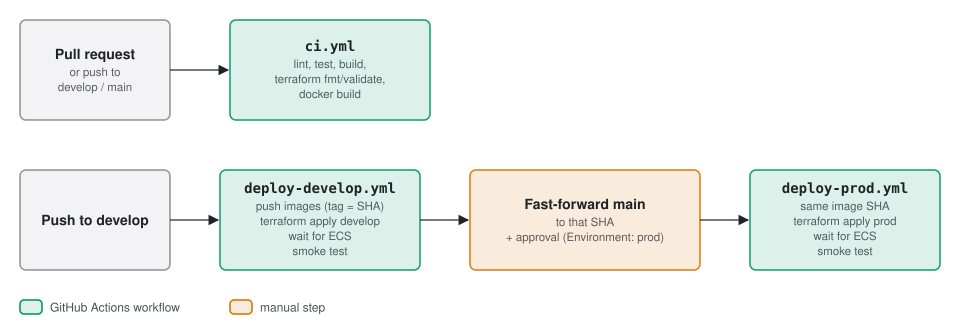

# CI/CD design

GitHub Actions builds, tests and deploys. No AWS credentials are stored in GitHub: each deploy workflow assumes
an environment-specific deploy role through **OIDC**.

## 1. Pipeline

Work lands on `develop`, which deploys the develop environment. `main` only ever moves by fast-forwarding to a
`develop` commit that is already running in develop, and a push to `main` promotes that commit's images to prod.

| Workflow | Trigger | Steps |
|---|---|---|
| `ci.yml` | Pull request; push to `develop` or `main` | **backend**: `uv sync`, `ruff check`, `pytest` against a Postgres 16 service container (graph tests use in-process fakes built from the seed customers). **mock**: `ruff check`, `pytest`. **frontend**: `pnpm install`, `pnpm lint`, `tsc --noEmit`, `pnpm build`. **terraform** (1.5.7): `fmt -recursive -check`, then `init -backend=false` and `validate` for `envs/develop`, `envs/prod` and `bootstrap`. **docker**: build all three images (no push). **docs**: `make docs-build`, the strict mkdocs build that fails on a broken link. **e2e**: `docker compose up --build --wait`, then the Playwright `local` project in Chromium; on failure the report, traces, videos and the stack's logs are uploaded |
| `deploy-develop.yml` | Push to `develop`; manual run on `develop` | Runs only when the repository variable `AWS_DEPLOY_ROLE_ARN_DEVELOP` is set. **images**: assume the develop role, build and push `onboarding/{backend,mock,frontend,docs}:<sha>` to ECR, skipping an image whose tag already exists (tags are immutable, so a re-run reuses it) (`docs` is the mkdocs site, built from the repo root with `docs-site/Dockerfile`). **deploy**: `terraform init` with the state bucket, `terraform apply` on `envs/develop` with `image_tag=<sha>`, `.github/scripts/wait-for-rollout.sh`, then the smoke test |
| `deploy-prod.yml` | Push to `main` (deploys its head); manual run with a full 40-character SHA, e.g. to roll back | Runs only when the repository variable `AWS_DEPLOY_ROLE_ARN_PROD` is set. Runs in the `prod` GitHub Environment, so its required reviewers must approve. Checks out that SHA, assumes the prod role, checks that the backend and frontend images for that SHA exist in ECR (no rebuild), `terraform apply` on `envs/prod`, waits for ECS, smoke test |
| `e2e-dev.yml` | A successful `deploy-develop` run; daily at 00:00 UTC (09:00 KST); manual run | Against the develop hosts: the Playwright `dev-smoke` checks, then the `dev-perf` page-load SLA (measured even if a smoke check failed). The HTML report with each page's p75 metrics is kept for 30 days. Does not deploy or gate anything; a failed run is the alert |

Not built: a `terraform plan` posted on the PR, and running the frontend unit tests (`pnpm test`) in CI; both run
locally (see the README).

## 2. OIDC and roles

- The `ci` Terraform module in each environment creates that environment's deploy role. The GitHub OIDC
  identity provider is account-wide: develop creates it, prod looks it up.
- Each role's trust policy is limited to this repository (`pjh4993/insurance-onboarding-assistant`) and one
  subject: the develop role to `ref:refs/heads/develop`, the prod role to `environment:prod`.
  The repository sends GitHub's immutable subject, which carries the owner and repository ids
  (`repo:pjh4993@12472082/insurance-onboarding-assistant@1379320933:…`), so a repository recreated under the same
  name gets no access. `modules/ci` variable `github_repository` holds that prefix.
- The role has `PowerUserAccess` (it applies the whole environment), plus IAM limited to `onboarding-*` roles and
  policies and the OIDC provider, read/write on the Terraform state bucket and lock table, and ECR push.
- Workflows request `id-token: write` and use `aws-actions/configure-aws-credentials` to assume the role.
  Credentials are short-lived.

## 3. Promotion by image SHA

Images are tagged with the git commit SHA, ECR tags are immutable, and prod never rebuilds. What runs in prod is
byte-for-byte the image that passed develop. `deploy-prod.yml` also checks out the same SHA, so the Terraform code
matches the images. Rolling back means deploying an earlier SHA. A push to `main` finds its images only because
`main` is fast-forwarded to a `develop` commit, never merged: a merge commit has no images, and the workflow stops
at the image check.

## 4. Deployment safety

- **ECS deployment circuit breaker** with rollback: if new tasks fail to become healthy, ECS returns to the
  previous task definition. The workflow then fails at `wait-for-rollout.sh`.
- The workflow waits until each service's new tasks are serving and no old task is still running, not for the old
  tasks to be fully torn down (`aws ecs wait services-stable` waits about two minutes longer, after traffic has
  already moved). Containers get 10 s after SIGTERM (`stopTimeout`), and uvicorn gives open SSE streams 5 s; browsers
  reconnect to the new tasks.
- Rolling deploys keep 100% of tasks healthy and allow up to 200% during the switch.
- The ALB checks the frontend at `/api/healthz`. The images carry their own health checks (frontend `/api/healthz`, backend
  `/healthz`).
- There is no separate migration step. The backend runs its Alembic migrations to head and upserts the catalog seed
  when it starts, under a Postgres advisory lock. A migration therefore reaches develop before prod, and runs
  while the old tasks still serve, so a migration must keep the previous release working (add a column, backfill,
  then tighten; drop only in a later release).
- Deploy workflows use a concurrency group, so two deploys to one environment never overlap.

## 5. Smoke test

The design: after a develop deploy, check the health endpoint, then run one full onboarding with seed customer A
(partner match → profiling → recommendation → application → submission reference) against the develop mock.

Built: `<base_url>/healthz`, retried for up to 5 minutes. That URL reaches the frontend, which relays to the
backend's `/healthz`, so it proves the ALB, the frontend and the frontend-to-backend hop. The full seed-A run is
covered by the backend's scenario tests in CI (`test_customer_a_partner_match_to_submission`).

## 6. One-time setup

The deploy role is created by the environment it deploys, so the first apply is done by an admin, and GitHub
needs a few settings. The full ordered list is in [terraform.md](03-terraform.md#one-time-setup). The GitHub side:

| Setting | Value | Used by |
|---|---|---|
| Repository variable `AWS_DEPLOY_ROLE_ARN_DEVELOP` | `terraform output deploy_role_arn` in `envs/develop` | `deploy-develop.yml`; its jobs are skipped while it is empty |
| Repository variable `TF_STATE_BUCKET` | `state_bucket_name` output of `infra/bootstrap` | Both deploy workflows |
| Environment `prod` with required reviewers | — | `deploy-prod.yml` approval |
| Environment `prod` variable `AWS_DEPLOY_ROLE_ARN_PROD` | `terraform output deploy_role_arn` in `envs/prod` | `deploy-prod.yml` |

## 7. Scope for this submission

| Part | Status |
|---|---|
| CI checks | Built and running |
| Develop deploy workflow (OIDC → ECR → Terraform → ECS → smoke test) | Built. Runs once the develop deploy role variable is set |
| Prod promotion workflow | Built; not run, since the prod apply is deferred |
