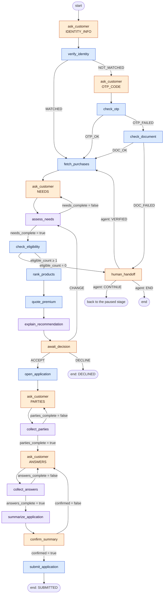

# LangGraph design

The backend runs one LangGraph graph per onboarding session. One session is one **thread**. The graph covers
the four stages the brief lists and pauses whenever it needs a person.

What the graph stores and how routing reads it is in [state-management.md](state-management.md).

## 1. The four stages

| Stage | What the customer does | What the system does | New entities | Stage ends when |
|---|---|---|---|---|
| 1. Identity verification | Gives name, email, phone, ID document, and consent to a partner lookup. Enters an OTP if asked | Partner match → OTP → ID document. Two failures hand off to an agent | `Party` | `Party.verification_status = VERIFIED` |
| 2. Customer profiling | Describes themselves and what they want to cover, in free text | Loads device purchases from the partner (with consent). LLM extracts profile fields. Asks again only for missing fields | `NeedsAssessment` (versioned), `InsurableObject` | `NeedsAssessment.missing_fields` is empty |
| 3. Policy recommendation | Accepts, declines, or changes their answers | Code checks eligibility, ranks and prices products. LLM explains the ranked result | `Recommendation`, `Quote` | One recommendation is `ACCEPTED` |
| 4. Policy application | Says who is insured and who pays, answers product questions, confirms the summary | Finds missing fields, validates completeness, writes a summary, submits | `Application`, `ApplicationParty`, other `Party` rows | `Application.status = SUBMITTED` with a submission reference |

Identity comes first. No profiling happens until identity is verified. See [assumptions.md](assumptions.md).

## 2. Nodes by type

Nodes are split by who decides.

| Type | What it does | Nodes |
|---|---|---|
| **Code** | Deterministic checks, calculations, external calls, writes | `verify_identity`, `check_otp`, `check_document`, `fetch_purchases`, `check_eligibility`, `rank_products`, `quote_premium`, `open_application`, `submit_application` |
| **LLM** | Extracts values from what people say, or writes text | `assess_needs`, `explain_recommendation`, `collect_parties`, `collect_answers`, `summarize_application` |
| **Wait** | Pauses with `interrupt()` until a person answers | `ask_customer`, `await_decision`, `confirm_summary`, `human_handoff` |

`ask_customer` is one node reused for every "please tell me X" pause. It sets `waiting_for` to the kind of
input it wants (`IDENTITY_INFO`, `OTP_CODE`, `NEEDS`, `PARTIES`, `ANSWERS`) and writes nothing else.

### What each node does

| Node | Stage | Reads | Writes | External call |
|---|---|---|---|---|
| `verify_identity` | 1 | Identity info from the customer | `Party` (contact fields, consent time, HMAC of the ID number) | Partner match (only with consent). If no match: send OTP |
| `check_otp` | 1 | OTP code, `otp_request_id` | `Party.verification_*` | Identity: verify OTP |
| `check_document` | 1 | ID document number given in step 1 | `Party.verification_*` | Identity: verify document |
| `fetch_purchases` | 2 | `Party.partner_customer_ref`, consent | `InsurableObject` (`source = PARTNER`) | Partner: purchases. Skipped silently without consent or match |
| `assess_needs` | 2 | Customer's text, earlier assessment | New `NeedsAssessment` version, `InsurableObject` if described by the customer | Bedrock (`NeedsExtraction`) |
| `check_eligibility` | 3 | Catalog rules, assessment, objects | `Recommendation` rows, **including ineligible ones** with failed rules | — |
| `rank_products` | 3 | `TargetMarket` weights | `Recommendation.rank`, `score` | — |
| `quote_premium` | 3 | `Product.rating`, object values | `Quote` per eligible recommendation | — |
| `explain_recommendation` | 3 | Ranked, priced recommendations; `TargetMarket.rationale` | `Recommendation.rationale` | Bedrock (`RecommendationRationale`) |
| `open_application` | 4 | Accepted recommendation and quote | `Application` (`DRAFT`) | — |
| `collect_parties` | 4 | Customer's text | `ApplicationParty`, new `Party` rows for others | Bedrock (`PartiesExtraction`) |
| `collect_answers` | 4 | Customer's text, `Product.required_application_fields` | `Application.answers`, `missing_fields`, status | Bedrock (`AnswersExtraction`) |
| `summarize_application` | 4 | Complete application | `Application.summary` | Bedrock (`ApplicationSummary`) |
| `submit_application` | 4 | Complete application | `Application.submission_ref`, `SUBMITTED` | Contract admin, with `Idempotency-Key` |

`quote_premium` runs before `explain_recommendation` so the explanation can mention the price.

## 3. Graph

Blue is code, purple is LLM, orange is a wait node. Not drawn: every node routes to `human_handoff` when its
retries run out (`last_error` is set).

### Conditional edges

Every routing function reads **only the state**, never the database. Routing can therefore be replayed from a
checkpoint and tested without a database.

| After | Reads | Branches |
|---|---|---|
| `verify_identity` | `identity_result` | `MATCHED` → `fetch_purchases`; `NOT_MATCHED` → wait for OTP |
| `check_otp` | `identity_result` | `OTP_OK` → `fetch_purchases`; `OTP_FAILED` → `check_document` |
| `check_document` | `identity_result` | `DOC_OK` → `fetch_purchases`; `DOC_FAILED` → `human_handoff` |
| `assess_needs` | `needs_complete` | false → ask for missing fields; true → `check_eligibility` |
| `check_eligibility` | `eligible_count` | 0 → `human_handoff`; ≥ 1 → `rank_products` |
| `await_decision` | `decision` | `ACCEPT` → `open_application`; `DECLINE` → end; `CHANGE` → `assess_needs` |
| `collect_parties` | `parties_complete` | false → ask again; true → ask for answers |
| `collect_answers` | `answers_complete` | false → ask for missing fields; true → `summarize_application` |
| `confirm_summary` | `confirmed` | true → `submit_application`; false → back to answers |
| any node | `last_error` | set → `human_handoff` |

`fetch_purchases` has no branch. Consent (`Party.third_party_consent_at`) is a precondition inside the node:
without consent or without a partner match it does nothing and passes on. The customer then describes the
device in their own words.

Routing signals are **results, not counters**. The number of failed identity attempts lives in
`Party.verification_attempts` in the database. The state holds only the last result (`OTP_FAILED`), and the graph
shape decides what follows: `OTP_FAILED` always goes to the document check, `DOC_FAILED` always goes to an agent.
That is how "two failures hand off" is enforced.

### The loop back

When the customer chooses `CHANGE` after seeing recommendations, `assess_needs` writes a **new**
`NeedsAssessment` version. All recommendations and quotes based on the old version become `EXPIRED`, and the
recommendation stage runs again. Old versions are kept so the agent can see what each recommendation was
based on.

## 4. Interrupt and resume

1. A wait node sets `waiting_for` and calls `interrupt(payload)`. The payload holds what the node is waiting for
   and the message to show.
2. The checkpointer saves the state. The HTTP request that drove the graph returns.
3. The backend copies `stage` and `waiting_for` into the `OnboardingSession` row and sends SSE events. The
   frontend shows the input that matches `waiting_for`. This is the "workflow visibility" the brief asks for.
4. When input arrives (`POST .../input` with `{type, data}`), the API checks that `type` equals the current
   `waiting_for`, sets `actor` (`CUSTOMER` or `AGENT`) and resumes the same thread with `Command(resume=data)`.
5. The paused node receives the value and the graph runs until the next wait node or the end.

The same mechanism covers three cases:

| Case | How |
|---|---|
| Multi-turn conversation | Every question is a wait node; every answer is a resume |
| Customer leaves and comes back | The graph stays paused in the checkpoint. The same link resumes from the last wait node |
| Agent takes over | The agent resumes the same thread with `actor = AGENT` |

## 5. Human handoff

`human_handoff` is a wait node with `waiting_for = AGENT`. It is reached in three ways:

| Trigger | Example |
|---|---|
| Identity failed twice (OTP, then document) | Seed customer D |
| No eligible product | The customer is told why; ineligible recommendations keep their failure reasons for the agent |
| A node ran out of retries | Bedrock throttling, a timeout in an external system |

The session's status becomes `HANDOFF` and it moves to the top of the agent's session list. The agent opens the
session, sees the conversation, the current node, the entities and the error, and resumes with an `AGENT`
input `{resolution, note?}`:

| Resolution | Meaning |
|---|---|
| `VERIFIED` | The agent verified the customer another way (for example by phone). Onboarding continues with profiling |
| `CONTINUE` | The problem is resolved (for example the external system is back). The graph continues from where it stopped |
| `END` | The session ends |

Taking over a session (`POST .../assign`) sets `assigned_agent_id` and `mode = ASSIST`. One agent per session:
assignment acts as a lock. Any input the agent sends afterwards is recorded with `captured_by = AGENT`.

## 6. Retries and error handling

| Failure | Handling |
|---|---|
| LLM or external call fails (timeout, 5xx, 429 / `ThrottlingException`) | LangGraph `RetryPolicy` with exponential backoff on LLM nodes and external-call nodes. When retries are used up the node sets `last_error = {node, kind, attempts}` and routes to `human_handoff`. The state is already saved up to the last finished node, so nobody starts over |
| LLM output does not match the schema | Treated as a retryable error on the extraction node |
| Customer input is incomplete | Not an error. `missing_fields` drives another question for just those fields |
| Quote expired (`valid_until` passed, for example after a long pause) | `quote_premium` runs again and the new price is shown |
| Node crashes after writing but before its checkpoint | On resume the node runs again. All writes are idempotent (deterministic IDs, upserts, `Idempotency-Key` on submission). See [state-management.md](state-management.md#7-idempotent-writes) |
| Customer withdraws | `Application.status = WITHDRAWN`, session ends |

Failures can be triggered on demand with the mock's `POST /_mock/faults {target, kind, count}` to show
retries and handoff.

## 7. LLM use

All LLM calls go through `langchain-aws` `ChatBedrockConverse` to the Bedrock Converse API with model
`global.anthropic.claude-sonnet-4-6` (global cross-region inference from `ap-northeast-2`). Each LLM node has
one Pydantic output schema and uses `with_structured_output` (`function_calling` method: the schema is passed as
a Converse tool and the model answers with a `toolUse` block). Temperature is kept low.

| Node | Output schema |
|---|---|
| `assess_needs` | `NeedsExtraction` |
| `explain_recommendation` | `RecommendationRationale` |
| `collect_parties` | `PartiesExtraction` |
| `collect_answers` | `AnswersExtraction` |
| `summarize_application` | `ApplicationSummary` |

The LLM never decides eligibility, rank or price. `explain_recommendation` is given the ranked, priced result
and the catalog's `TargetMarket.rationale` sentences as its only grounds, so it cannot invent reasons.

## 8. How the six LangGraph requirements are met

| Requirement | Where |
|---|---|
| **State management** | Typed `OnboardingState` with reducers, persisted after every node by `PostgresSaver`. Entity values live in the domain DB, the state holds their IDs. See [state-management.md](state-management.md) |
| **Conditional routing** | Ten conditional edges driven by routing signals in state (`identity_result`, `needs_complete`, `eligible_count`, `decision`, `parties_complete`, `answers_complete`, `confirmed`, `last_error`) |
| **Multi-turn workflows** | Wait nodes use `interrupt()`; each answer resumes the same thread. Loops ask again only for missing fields (profiling, parties, answers) |
| **Context awareness** | `messages` carries the whole conversation into every LLM node. Extraction nodes see earlier answers and the current assessment version, so a correction ("actually I'm 40") creates a new version instead of starting over. Partner purchases pre-fill the device so the customer is not asked for it |
| **Workflow transitions** | `stage` moves IDENTITY → PROFILING → RECOMMENDATION → APPLICATION → SUBMITTED, with exits to HANDOFF, DECLINED, WITHDRAWN. The `CHANGE` edge moves back from recommendation to profiling and expires old recommendations. Each transition is mirrored to `OnboardingSession` and pushed to the UI over SSE |
| **Error handling** | Per-node retry with backoff, `last_error` → `human_handoff`, idempotent writes and idempotent submission, fault injection in the mock to show all of this |
