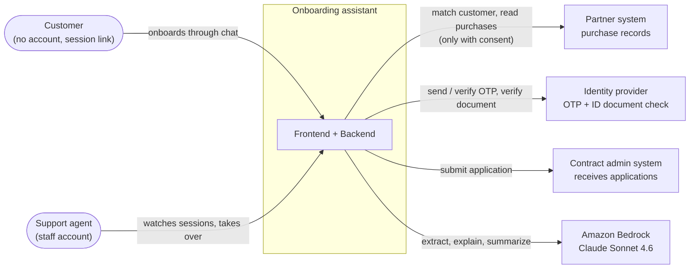
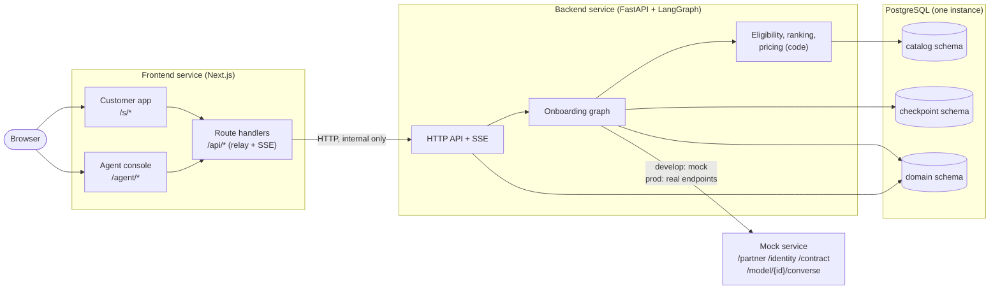
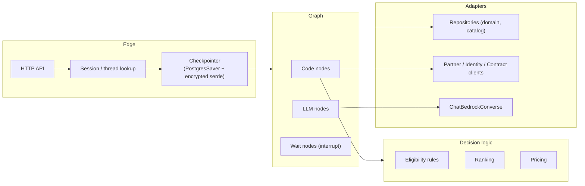

# Solution architecture

This document describes the system at the two outer levels of the C4 model: **context** (who uses it and
what it talks to) and **containers** (what is deployed and how the parts talk). The graph inside the backend
is in [langgraph-design.md](langgraph-design.md). The AWS mapping is in [aws-architecture.md](aws-architecture.md).

## 1. System context

Two kinds of people use the system.

| Person | How they get in | What they do |
|---|---|---|
| Customer | A session link `/s/{token}`. No account | Goes through the four onboarding stages in a chat |
| Support agent | Agent console `/agent`. Staff login (Cognito in AWS, a dev header locally) | Sees all sessions, opens a new session link, takes over a stuck session, answers on the customer's behalf |

The brief says the assistant "helps support agents guide customers" and also asks for a "customer onboarding
interface". We support both: the customer drives the chat, and an agent can step in at any point. See
[assumptions.md](assumptions.md).

There are four external systems.

| System | Used for | Called by node |
|---|---|---|
| Partner | Match the customer to a partner record; read device purchases | `verify_identity`, `fetch_purchases` |
| Identity | Send and verify an OTP; verify an ID document number | `verify_identity`, `check_otp`, `check_document` |
| Contract admin | Receive the finished application and return a submission reference | `submit_application` |
| Amazon Bedrock | LLM calls through the Converse API | the five LLM nodes |

**Mock in develop, real endpoints in prod.** In develop (and locally) all four are served by **one mock
service** that has the same API shapes as the real systems. In prod the mock is not deployed and the backend
points at real endpoints. The backend code is the same in both; only four environment variables change
(`PARTNER_API_URL`, `IDENTITY_API_URL`, `CONTRACT_API_URL`, `BEDROCK_ENDPOINT_URL`). There is no
"am I talking to a mock?" branch in the code. Real partner, identity and contract endpoints do not exist yet, so
prod leaves those values empty.

## 2. Containers

The brief requires two services that are deployed separately. We keep that split.

| Container | Technology | Responsibility |
|---|---|---|
| Frontend | Next.js (App Router, TypeScript, pnpm) | Two apps in one service: the customer app (`/s/*`) and the agent console (`/agent/*`). Route handlers under `/api/*` relay every call, including SSE, to the backend. The browser never calls the backend directly |
| Backend | FastAPI + LangGraph, Python 3.13, uv | HTTP API, the onboarding graph, eligibility, ranking and pricing, persistence, calls to external systems |
| PostgreSQL | PostgreSQL 16 (RDS in AWS) | Three schemas: `checkpoint` (graph state), `domain` (customer and transaction entities), `catalog` (products, rules) |
| Mock | FastAPI | One app for all four external systems plus fault injection (`/_mock/faults`). Develop and local only |

Why the three schemas share one instance: they differ in lifetime and access, but not enough to justify
three databases for this scope. Checkpoints are only useful while a session is alive (30-day inactivity limit),
domain entities live as long as the customer relationship, and the catalog is read-only for the graph.

Why the customer app and the agent console share one service: the brief asks for exactly two services. The
two apps have separate layouts, routes and auth rules, so they behave as separate apps to users while the
deployment stays at two units.

### Frontend-to-backend communication

- The browser talks only to the frontend (through the ALB in AWS).
- The frontend's route handlers call the backend at `BACKEND_URL` (`http://backend:8000`: Docker Compose
  locally, ECS Service Connect in AWS).
- Chat updates are streamed with **server-sent events**. The backend emits SSE, and the frontend passes the
  stream through unchanged.
- Agent identity is checked once at the frontend and passed to the backend as `X-Agent-Id`. The customer's
  session token is passed as `X-Session-Token`.

The API contract is in [`CONTRACTS.md`](../CONTRACTS.md) §3. Main endpoints:

| Caller | Endpoint | Purpose |
|---|---|---|
| Agent console | `POST /api/sessions` | Create a session and return the customer link `/s/{token}` |
| Customer app | `GET /api/customer/session`, `POST .../input`, `GET .../stream` | Read the session, send input, stream updates |
| Agent console | `GET /api/agent/sessions`, `GET /api/agent/sessions/{id}`, `POST .../assign`, `POST .../input`, `GET /api/agent/stream` | Session list, session detail with entities, take over, answer as agent, stream |

## 3. Inside the backend

The left column is why sessions can be resumed: the API receives input, finds the thread for the session,
and the checkpointer loads the paused state.

Eligibility, ranking and pricing are plain code, not LLM calls. An agent must be able to see **why** a product
was excluded (`EligibilityRule.failure_reason_code`) and **why** a price is what it is (`Quote.rating_inputs`).
A sentence written by an LLM cannot be traced back like that. The LLM only extracts values from what people
say and explains results the code already produced.

## 4. Scope boundary

The system ends when the contract admin system returns a submission reference
(`Application.submission_ref`). Underwriting and policy issuance belong to the contract admin system and are out
of scope. The `Policy` entity is named in the model but has no fields.
