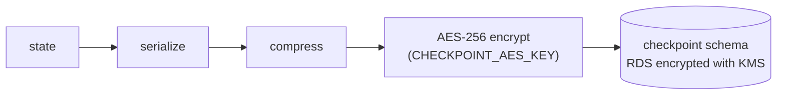

# State management

This is the state model for the onboarding graph: what the graph passes between nodes, what conditional
edges read, what is saved when the graph pauses, and how personal data is protected.

## 1. Three principles

1. **IDs in state, values in the database.** A node writes entity values to the domain schema and returns only
   the entity's ID to the state. Keeping one value in two places means they drift apart eventually.
2. **Everything a conditional edge reads is in the state.** Routing functions never query the database.
   Branching can be replayed from a checkpoint alone, and routing can be unit-tested without a database.
3. **Wait nodes pause with `interrupt()`.** A person's input resumes the same thread with
   `Command(resume=...)`. Session resume and agent handoff use this same mechanism.

## 2. Where data lives

| Store | Holds | Lifetime | Written by |
|---|---|---|---|
| Graph checkpoint (`checkpoint` schema) | `OnboardingState`, below | One onboarding session. Deleted after 30 days without activity | `PostgresSaver`, after every node |
| Domain DB (`domain` schema) | Customer and transaction entities, session links | The customer relationship | Nodes and the API, through repositories |
| Catalog (`catalog` schema) | `Product`, `EligibilityRule`, `TargetMarket` | While a product is on sale | Migrations. The graph only reads it |

One thread is one onboarding session. The backend creates the `thread_id` when the session is created
(`POST /api/sessions`). The customer and the agent open the same thread.

## 3. State schema

```python
class OnboardingState(TypedDict):
    # conversation
    messages: Annotated[list[AnyMessage], add_messages]
    actor: Literal["CUSTOMER", "AGENT"]
    mode: Literal["AUTO", "ASSIST"]

    # progress
    stage: Literal["IDENTITY", "PROFILING", "RECOMMENDATION", "APPLICATION",
                   "SUBMITTED", "HANDOFF", "DECLINED", "WITHDRAWN"]
    waiting_for: Literal["IDENTITY_INFO", "OTP_CODE", "NEEDS", "DECISION",
                         "PARTIES", "ANSWERS", "CONFIRM", "AGENT"] | None

    # entity references (values live in the domain DB)
    party_id: UUID | None
    needs_assessment_id: UUID | None          # latest version
    insurable_object_ids: list[UUID]
    recommendation_ids: list[UUID]
    quote_ids: dict[UUID, UUID]               # recommendation_id -> quote_id
    application_id: UUID | None
    otp_request_id: str | None

    # routing signals (result of the previous node)
    identity_result: Literal["MATCHED", "NOT_MATCHED", "OTP_OK", "OTP_FAILED",
                             "DOC_OK", "DOC_FAILED"] | None
    needs_complete: bool
    eligible_count: int
    decision: Literal["ACCEPT", "DECLINE", "CHANGE"] | None
    parties_complete: bool
    answers_complete: bool
    confirmed: bool | None

    # errors
    last_error: ErrorInfo | None              # node, kind, attempts
```

Field names follow the design; the implementation in `backend/app/graph/` is the final reference.

### Field groups and reducers

| Group | Fields | Written by | Reducer |
|---|---|---|---|
| Conversation | `messages` | Every node and every human input | `add_messages`: append |
| Conversation | `actor` | The API when it resumes the graph | Overwrite. Copied into `captured_by` and `decided_by` on entities |
| Conversation | `mode` | The API when an agent takes over | Overwrite |
| Progress | `stage`, `waiting_for` | Nodes that change stage; wait nodes | Overwrite |
| Entity references | `*_id`, `*_ids` | The node that creates the entity | Overwrite. Lists are replaced whole |
| Routing signals | `identity_result`, `needs_complete`, ... | The node just before the edge | Overwrite |
| Errors | `last_error` | A node that used up its retries | Overwrite |

Only `messages` needs a merging reducer. Everything else is overwritten, which keeps each field owned by the
node that last decided it.

### What is not in the state

Extracted personal values (name, phone, ID number), recommendation reasons and prices. They are entity
fields and live only in the domain DB.

### State vs. entity fields with similar names

| State | Entity | Relation |
|---|---|---|
| `needs_complete` | `NeedsAssessment.missing_fields` | The entity holds the list; the state only knows whether it is empty |
| `answers_complete` | `Application.missing_fields` | Same |
| `identity_result` | `Party.verification_status`, `verification_method` | The entity holds the final result; the state holds the last attempt |
| `decision` | `Recommendation.status` | A node reads `decision` and updates the entity |
| `actor` | `captured_by`, `decided_by` | The state value is copied into the entity |

## 4. Routing signals

A routing signal is the **result** of the previous node, not a counter or a history. Failed identity attempts
are counted in `Party.verification_attempts` in the database. The state keeps only the latest result, and the
graph's shape decides what follows each result. The full edge table is in
[langgraph-design.md](langgraph-design.md#conditional-edges).

## 5. Session summary for the UI

After each run, the backend copies `stage` and `waiting_for` from the state into the `OnboardingSession` row,
along with `status`, `mode`, `assigned_agent_id` and `last_activity_at`. The agent's session list reads these
rows. It never has to load and decrypt every checkpoint to draw the list.

## 6. Checkpointing

The checkpointer is `PostgresSaver` from `langgraph-checkpoint-postgres`, writing to the `checkpoint` schema.
State is saved after every node.

**Encryption: compress, then AES.** `messages` holds what the customer typed, including name, phone number
and ID number. Storage encryption (RDS with KMS) alone lets anyone who can read the table see plain text. So the
checkpoint content is encrypted in the application too:



- The serializer passed to `PostgresSaver` (`serde=`) compresses first and encrypts second. Ciphertext does not
  compress, so the order matters.
- The key is a 256-bit AES key (`CHECKPOINT_AES_KEY`, 64 hex chars). In AWS it lives in Secrets Manager and only
  the backend task role can read it.
- `PostgresSaver` accepts the serializer as a constructor argument. That was the reason for choosing it over
  the DynamoDB saver. See [tradeoffs.md](tradeoffs.md#3-checkpoint-store-dynamodb-vs-postgresql).
- The key is not rotated. Reading with a different key fails. Rotation is in
  [future-improvements.md](future-improvements.md).

**Retention.** Checkpoints are meant to be deleted after 30 days without activity: that is both the window in
which a customer can resume and the window in which the conversation's personal data is kept. The daily cleanup
job is designed but deferred (see [future-improvements.md](future-improvements.md)). Domain entities outlive the
checkpoint, so a session's outcome (submission, decline, withdrawal) stays visible after its conversation is gone.

## 7. Idempotent writes

The checkpoint and the entities share one PostgreSQL instance, but they are **not** written in one
transaction: LangGraph saves the checkpoint on its own connection after the node returns. If a node writes
entities and the process dies before the checkpoint is saved, the node runs again on resume. Every node write
must therefore be safe to repeat.

| Technique | How |
|---|---|
| Deterministic entity IDs | New IDs are `uuid5(thread_id, node name, step)`. A re-run produces the same ID, so the write is an upsert |
| Idempotency key on external calls | `submit_application` sends `Idempotency-Key: <application_id>`. The contract admin system returns the first response again (`200` with the same `submission_ref`), so an application is never received twice |
| Retries per node | `RetryPolicy` with exponential backoff on LLM and external-call nodes. When retries run out, `last_error` is set and the graph goes to `human_handoff` |

## 8. Personal data

| Data | Handling |
|---|---|
| Name, email, phone, date of birth | Stored in `Party` in the domain schema. Not copied into the state |
| ID document number | Never stored in plain text. An HMAC (`id_document_hmac`, secret key) is stored so it can be matched later. A plain hash is not enough because ID numbers have few possible values. The agent API never returns the number |
| Conversation text | In `messages` inside the checkpoint: compressed and AES-encrypted, on KMS-encrypted storage |
| OTP code | Not stored anywhere. Only `otp_request_id` is kept in the state |
| Session link token | Only its HMAC (`token_hmac`, `SESSION_HMAC_KEY`) is stored. One token reaches one thread |
| Logs | Message bodies are not logged |
| SSE events | Carry types and IDs, not personal values. The screen reads details through the API |
| Partner lookup | Only after consent. The consent time is recorded in `Party.third_party_consent_at` and sent as `X-Consent-At`; the partner (and the mock) returns `403` without it |
| Contract submission | ID number and contact details are not sent. The contract admin system does not need them to receive the application |
