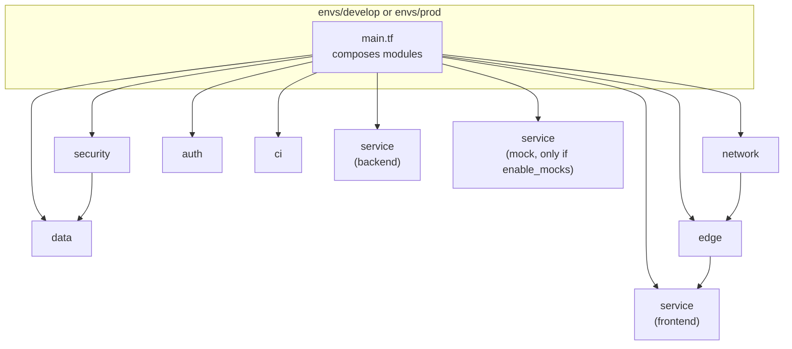

# Terraform structure

All AWS resources are defined in `infra/`. Reusable modules hold the resources; each environment is a thin
composition of those modules with its own variables and its own state.

## 1. Layout

```
infra/
  modules/
    network/    VPC, subnets, route tables, NAT, VPC endpoints (AZ placement is a variable)
    security/   security groups, KMS key
    data/       RDS PostgreSQL (three schemas), checkpoint cleanup schedule (EventBridge Scheduler)
    auth/       Cognito user pool, app client
    edge/       ALB, listeners, certificate, /agent/* Cognito auth rule
    service/    one ECS service: task definition, Service Connect, task + execution roles, log group
    ci/         GitHub OIDC provider, deploy roles, ECR repositories
  envs/
    develop/    module composition, enable_mocks = true, interface endpoints in 2a only
    prod/       module composition, enable_mocks = false, endpoints in both AZs
```



## 2. Modules

| Module | Main resources | Key inputs | Key outputs |
|---|---|---|---|
| `network` | VPC `10.0.0.0/16`, 3 subnet tiers × 2 AZs, NAT, gateway and interface endpoints | CIDRs, number of NATs, AZs for interface endpoints | VPC ID, subnet IDs |
| `security` | `sg-alb`, `sg-frontend`, `sg-backend`, `sg-mock`, `sg-rds`, `sg-endpoints`; KMS key | VPC ID | SG IDs, KMS key ARN |
| `data` | RDS instance and subnet group, managed master secret, cleanup schedule | Instance size, Multi-AZ flag, KMS key | Endpoint, secret ARN |
| `auth` | Cognito user pool and app client for agents | Domain (optional) | Pool ARN, client ID |
| `edge` | ALB, HTTP→HTTPS redirect, HTTPS listener, ACM certificate, Cognito rule on `/agent/*`, idle timeout 300 s | Domain (optional), subnets, SG | Target group ARN, DNS name |
| `service` | ECS service, task definition, Service Connect config, IAM roles, CloudWatch log group | Image, port, env vars, secrets, desired count, SG | Service name |
| `ci` | GitHub OIDC identity provider, one deploy role per environment, ECR repositories | GitHub repo, branch/environment conditions | Role ARNs, repo URLs |

The `service` module is used three times: frontend, backend and mock. The mock instance is created only when
`enable_mocks = true`.

HTTPS and Cognito depend on a domain. The certificate, HTTPS listener and Cognito rule are enabled by a domain
variable, so the stack can be planned and applied without one.

## 3. Environments

| Variable | develop | prod |
|---|---|---|
| `enable_mocks` | `true` | `false` |
| Interface endpoint AZs | `2a` | `2a`, `2c` |
| NAT gateways | 1 | 2 |
| Desired tasks per service | 1 | 2 |
| RDS Multi-AZ | no | yes |
| `PARTNER_API_URL`, `IDENTITY_API_URL`, `CONTRACT_API_URL` | `http://mock:8080/partner` etc. (Service Connect) | Real addresses (empty until they exist) |
| `BEDROCK_ENDPOINT_URL` | `http://mock:8080` | unset (AWS default endpoint) |

External-system addresses are set only in `envs/`. The backend image is identical in both.

## 4. State backend

- Remote state in **S3**, one state key per environment, so develop and prod never share state.
- State locking is enabled, so two runs cannot change one environment at the same time.
- The state bucket itself is created once outside these environments (bootstrap), since a stack cannot store
  its state in a bucket it creates.
- Local `.terraform/` and `*.tfstate*` files are ignored by git.

## 5. How it is run

| Where | Command |
|---|---|
| PR (CI) | `terraform fmt -check`, `terraform validate`, `terraform plan` for develop; the plan is posted on the PR |
| Merge to `develop` (CI) | `terraform apply` for `envs/develop` |
| Prod | `terraform apply` for `envs/prod` behind approval (deferred for this submission) |
| Locally | `cd infra/envs/develop && terraform init && terraform plan` |

Terraform >= 1.5 with the AWS provider.
